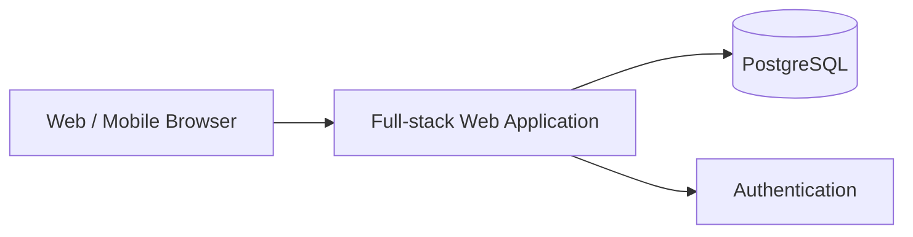

# Especificação de Produto e Implementação — Plataforma da Comunidade

> **Documento mestre para geração da aplicação via Codex**  
> Status: especificação inicial completa para implementação do zero  
> Idioma principal da interface: **Português (Brasil)**  
> Tipo de aplicação: **Web responsiva, mobile-first**  
> Papel deste arquivo: **fonte de verdade funcional e técnica para a primeira versão do produto**

---

## 1. Instruções diretas para o Codex

Você está implementando uma aplicação web do zero a partir desta especificação.

### 1.1 Objetivo da execução

Entregar uma aplicação funcional, testada e pronta para desenvolvimento local, contendo:

- autenticação;
- gestão de comunidade e membros;
- calendário pessoal de disponibilidade/folgas;
- escalas recorrentes de trabalho;
- calendário consolidado do grupo;
- cálculo dos melhores dias em comum;
- eventos e confirmação de presença;
- votações;
- dashboard da comunidade;
- perfis básicos;
- estrutura preparada para módulos futuros de games, geradores aleatórios, caronas, custos e gamificação.

### 1.2 Regras de implementação

1. Não implementar apenas mockups estáticos.
2. Toda funcionalidade principal deve persistir dados em banco.
3. A aplicação deve funcionar localmente com dados de demonstração.
4. Criar migrations e seed do banco.
5. Incluir testes unitários e de integração das principais regras de negócio.
6. Incluir testes end-to-end para os fluxos críticos.
7. Priorizar código legível, modular e fortemente tipado.
8. Não duplicar regras de negócio entre frontend e backend.
9. Validar inputs tanto no cliente quanto no servidor.
10. Implementar autorização no servidor; nunca depender apenas de esconder elementos da UI.
11. Utilizar timezone de forma explícita e consistente.
12. Não armazenar tokens, senhas ou secrets no código.
13. Criar `.env.example` completo.
14. Incluir um `README.md` com setup, execução, testes e arquitetura.
15. Quando houver ambiguidade, seguir o comportamento mais simples que preserve extensibilidade futura.
16. Evitar overengineering no MVP.
17. Não adicionar funcionalidades fora desta especificação sem necessidade técnica clara.
18. Se uma biblioteca específica estiver obsoleta no momento da implementação, substituí-la por equivalente estável e documentar a decisão.

### 1.3 Definição de pronto

O projeto só deve ser considerado pronto quando:

- instala dependências sem erros;
- sobe banco e aplicação localmente;
- migrations executam corretamente;
- seed cria dados de exemplo;
- login funciona;
- os fluxos críticos descritos neste documento funcionam ponta a ponta;
- lint passa;
- typecheck passa;
- testes automatizados passam;
- build de produção passa;
- não existem erros críticos no console do navegador;
- a aplicação é utilizável em desktop e mobile.

---

# 2. Visão do produto

## 2.1 Conceito

A aplicação será um **hub privado para uma comunidade de amigos**, atualmente organizada principalmente através de grupos de WhatsApp.

O objetivo não é substituir o WhatsApp como ferramenta de conversa, e sim resolver atividades que ficam ruins ou desorganizadas dentro de chats:

- descobrir quando várias pessoas estão livres ao mesmo tempo;
- organizar escalas e folgas;
- planejar passeios;
- criar eventos;
- votar em datas, destinos ou atividades;
- acompanhar quem vai participar;
- visualizar próximos compromissos do grupo;
- futuramente organizar games, geradores aleatórios para grupos, caronas, divisão de custos e estatísticas da comunidade.

## 2.2 Proposta de valor

A pergunta central que a plataforma deve responder é:

> **“Quando estamos livres e o que podemos fazer juntos?”**

A aplicação deve conectar quatro conceitos principais:

1. pessoas;
2. disponibilidade;
3. eventos;
4. votações.

---

# 3. Princípios de produto

## 3.1 WhatsApp continua sendo o canal de conversa

A plataforma não deve implementar chat no MVP.

Ela deve complementar o WhatsApp oferecendo páginas compartilháveis para eventos, votações e calendário.

## 3.2 Mobile-first

A maioria dos acessos provavelmente ocorrerá a partir de links enviados no WhatsApp.

A experiência mobile é prioritária.

## 3.3 Baixa fricção

Registrar uma folga, confirmar presença ou votar deve exigir poucos toques.

## 3.4 Privacidade por padrão

A plataforma é voltada a comunidades privadas.

Dados pessoais e calendários não devem ficar publicamente indexáveis.

## 3.5 Gamificação opcional

Gamificação pode existir futuramente, porém não deve bloquear nem poluir a experiência principal.

---

# 4. Escopo do MVP

## 4.1 Incluído no MVP

### Conta e autenticação

- cadastro somente por convite válido, sem vínculo obrigatório com e-mail;
- código secreto de bootstrap aceito exclusivamente para a primeira conta de uma instalação vazia;
- confirmação de senha obrigatória no cadastro;
- login;
- logout;
- recuperação de senha, se o mecanismo de autenticação escolhido suportar facilmente;
- nome de exibição;
- avatar opcional.

### Comunidades

- criar comunidade;
- entrar em comunidade por convite;
- visualizar membros;
- papéis básicos de administrador e membro.

### Disponibilidade

- marcar um dia inteiro como disponível;
- marcar um dia inteiro como indisponível;
- marcar períodos do dia;
- registrar trabalho;
- registrar folga;
- registrar férias;
- criar escala recorrente;
- visualizar calendário individual;
- visualizar calendário consolidado da comunidade.

### Inteligência de disponibilidade

- contar membros disponíveis por dia;
- ordenar melhores datas;
- filtrar por período;
- filtrar por número mínimo de pessoas;
- calcular disponibilidade por intervalo de datas;
- sugerir os melhores dias para criar um evento.

### Eventos

- criar evento;
- editar evento;
- cancelar evento;
- confirmar presença;
- marcar “talvez”;
- recusar participação;
- permitir que o criador desative a resposta “talvez”;
- permitir, quando habilitado pelo criador, que cada participante informe os dias específicos em que irá;
- mostrar lista de participantes;
- associar localização, horário, descrição e custo estimado.

### Votações

- criar enquete;
- escolha única;
- múltipla escolha;
- votação de datas;
- prazo opcional;
- resultado em tempo real;
- opção para permitir ou impedir alteração de voto.
- opções enriquecidas com descrição, página, local e álbum de fotos privado.

### Dashboard

- próximos eventos;
- votações abertas;
- melhores datas futuras;
- resumo rápido da comunidade.

### Compartilhamento

- botão “Compartilhar no WhatsApp” ou compartilhamento nativo do navegador;
- texto amigável para evento;
- texto amigável para votação;
- link profundo para a página correspondente.

## 4.2 Fora do MVP

Não implementar na primeira versão, mas manter arquitetura preparada para:

- chat;
- notificações push avançadas;
- integração oficial com API do WhatsApp;
- sincronização com Google Calendar/Outlook;
- pagamentos;
- rateio financeiro;
- caronas;
- biblioteca completa de jogos;
- ranking de games;
- times balanceados;
- conquistas;
- estatísticas históricas avançadas;
- álbum social de fotos de eventos;
- mapa avançado;
- recomendação automática de locais externos;
- sistema público de descoberta de comunidades.

O feed social deixou este backlog e foi entregue posteriormente como a evolução privada descrita
na seção 30.10; ele não fazia parte da primeira versão do MVP.

---

# 5. Personas e papéis

## 5.1 Administrador da comunidade

Pode:

- editar informações da comunidade;
- convidar membros;
- remover membros;
- promover/rebaixar administradores;
- criar/editar/cancelar qualquer evento;
- moderar votações;
- consultar dados consolidados da comunidade.

## 5.2 Membro

Pode:

- editar o próprio perfil;
- editar a própria disponibilidade;
- criar eventos, salvo configuração futura em contrário;
- criar votações;
- votar;
- responder a eventos;
- visualizar informações da comunidade.

## 5.3 Regra de segurança

Um usuário só pode acessar dados de comunidades das quais é membro.

---

# 6. Fluxos principais

## 6.1 Primeiro acesso

1. Usuário abre a aplicação.
2. Cria conta por um convite válido ou autentica em uma conta existente.
3. Pode:
   - criar uma nova comunidade; ou
   - entrar através de um convite.
4. Completa nome de exibição e avatar opcional.
5. Acessa dashboard.

## 6.2 Configurar escala de trabalho

1. Usuário abre “Minha agenda”.
2. Seleciona “Adicionar escala”.
3. Escolhe tipo de escala.
4. Define data inicial.
5. Define padrão.
6. Visualiza prévia.
7. Confirma.
8. Sistema gera ocorrências futuras de forma calculada ou persistida conforme decisão de arquitetura.

## 6.3 Encontrar melhor data

1. Usuário abre calendário da comunidade.
2. Escolhe intervalo, por exemplo “próximos 60 dias”.
3. Sistema calcula quantidade de membros disponíveis em cada data.
4. Sistema mostra melhores datas ordenadas.
5. Usuário seleciona uma data.
6. Pode criar um evento ou votação diretamente daquela data.

## 6.4 Criar evento

1. Usuário seleciona “Novo evento”.
2. Preenche título, descrição, data, horário e local.
3. Opcionalmente informa custo aproximado e limite de participantes.
4. Publica.
5. Evento aparece no dashboard.
6. Membros podem responder “Vou”, “Talvez” ou “Não vou”.
7. Quando houver custo estimado, a página mostra a estimativa por participante confirmado (`GOING`),
   recalculada conforme os RSVPs, sem criar cobranças ou registrar pagamentos.
8. O criador pode desativar “Talvez” e, em eventos com mais de um dia, habilitar presença parcial.
9. Quando a presença parcial estiver habilitada, o membro pode responder pelo evento inteiro ou
   selecionar um ou mais dias dentro do intervalo do evento.

## 6.5 Criar votação

1. Usuário abre “Votações”.
2. Cria votação.
3. Escolhe tipo.
4. Adiciona opções.
5. Define prazo opcional.
6. Publica.
7. Membros votam.
8. Resultados são atualizados.

## 6.6 Votar em datas sugeridas

1. Usuário inicia votação do tipo “datas”.
2. O sistema oferece datas com maior sobreposição de disponibilidade.
3. O criador seleciona datas candidatas.
4. Membros votam.
5. Resultado exibe votos e, separadamente, quantidade de pessoas já marcadas como disponíveis em cada data.

---

# 7. Navegação principal

Mobile:

- Início
- Comunicação
- Agenda
- Eventos
- Votações
- Mais

Desktop:

- Dashboard
- Comunicação
- Calendário
- Eventos
- Votações
- Membros
- Configurações

Menu de usuário:

- Meu perfil
- Minha disponibilidade
- Trocar de comunidade
- Sair

---

# 8. Dashboard

O dashboard deve responder rapidamente:

- qual é o próximo evento?
- existem votações abertas?
- quais são os melhores próximos dias para o grupo?
- quantas pessoas estão disponíveis no próximo fim de semana?

## 8.1 Blocos sugeridos

### Próxima melhor data

Exemplo:

```text
19 de setembro
11 de 14 pessoas disponíveis
```

Ações:

- ver detalhes;
- criar evento;
- criar votação.

### Próximos eventos

Mostrar próximos 3 a 5 eventos.

### Votações abertas

Mostrar até 3 votações com prazo ou participação.

### Disponibilidade dos próximos 7 dias

Gráfico ou cards simples com contagem diária.

### Comunicação da comunidade

Destacar uma publicação recente ou com maior interação entre os 15 posts mais recentes e oferecer acesso
direto ao feed privado.

---

# 9. Disponibilidade e calendário

## 9.1 Tipos de status

Criar enum equivalente a:

```text
AVAILABLE
PARTIALLY_AVAILABLE
WORKING
DAY_OFF
VACATION
UNAVAILABLE
UNKNOWN
```

`UNKNOWN` significa que o usuário não informou nada.

Não tratar `UNKNOWN` automaticamente como disponível.

## 9.2 Períodos do dia

Suportar:

- dia inteiro;
- manhã;
- tarde;
- noite;
- intervalo personalizado opcional.

Estrutura recomendada:

```text
start_at
end_at
all_day
status
```

## 9.3 Prioridade de ocorrências

Caso uma escala recorrente gere “WORKING”, mas o usuário adicione manualmente “DAY_OFF” naquela data, o registro manual deve prevalecer.

Ordem conceitual:

```text
manual override > recurrence rule > unknown
```

## 9.4 Escalas recorrentes

Suportar inicialmente:

### Semanal

Exemplos:

- trabalha segunda a sexta;
- folga sábado e domingo;
- trabalha apenas segunda, quarta e sexta.

### Alternância N por M

Exemplos:

- 12x36;
- 4x2;
- 5x1;
- 6x1.

Modelo genérico:

```text
work_days = N
rest_days = M
anchor_date = data inicial do ciclo
```

A aplicação deve calcular o estado de uma determinada data pela posição no ciclo.

## 9.5 Calendário consolidado

Cada dia deve exibir:

- total de membros;
- disponíveis;
- parcialmente disponíveis;
- trabalhando;
- indisponíveis;
- sem informação.

Quando houver eventos publicados no intervalo, o dia também deve exibir seus eventos. Cada evento
deve usar um indicador visual baseado na resposta do usuário atual: `Vou`, `Talvez`, `Não vou` ou
`Sem resposta`, com acesso à página do evento para consultar ou alterar o RSVP.

Ao abrir o dia, listar membros agrupados por estado.

## 9.6 Cálculo de score da data

No MVP usar regra simples e transparente.

Exemplo:

```text
available = 1.0
partially_available = 0.5
day_off = 1.0
vacation = 1.0
working = 0.0
unavailable = 0.0
unknown = 0.0
```

Score:

```text
sum(member_score)
```

Também exibir a contagem absoluta de pessoas com disponibilidade completa.

Não esconder o cálculo do usuário.

## 9.7 Filtros

- período;
- somente finais de semana;
- mínimo de pessoas;
- período do dia;
- membros específicos, opcional;
- atividade/interesse, preparado para fase futura.

## 9.8 Feriados e folgas extras

- `OWNER` e `ADMIN` podem cadastrar e remover feriados da comunidade;
- feriado é informação de calendário e não muda automaticamente a disponibilidade dos membros,
  porque escalas como 12×36 podem manter trabalho em feriados;
- o nome do feriado deve aparecer nas visões mensal e em lista;
- qualquer membro pode cadastrar uma folga extra própria como override `DAY_OFF` de dia inteiro;
- folga extra pode cobrir uma data ou intervalo e pode ter observação;
- folga extra prevalece sobre a escala recorrente conforme a prioridade de overrides.

---

# 10. Eventos

## 10.1 Campos

```text
id
title
description
community_id
created_by
starts_at
ends_at
all_day
timezone
location_name
location_address
location_url
estimated_cost
currency
participant_limit
allow_maybe
allow_partial_attendance
status
created_at
updated_at
```

## 10.2 Status

```text
DRAFT
PUBLISHED
CANCELLED
COMPLETED
```

No MVP, `DRAFT` pode ser omitido da UI se simplificar a entrega.

## 10.3 RSVP

Enum:

```text
GOING
MAYBE
NOT_GOING
```

Cada membro possui no máximo uma resposta por evento.

Nova resposta substitui a anterior.

O criador pode desabilitar `MAYBE`. Essa restrição deve ser aplicada no servidor, inclusive para
clientes antigos. Em eventos com mais de um dia, o criador pode habilitar presença parcial. Nesse
caso, respostas `GOING` e `MAYBE` podem se referir ao evento inteiro ou a um subconjunto não vazio
de datas civis contidas no intervalo do evento. Respostas `NOT_GOING` nunca possuem datas de presença.

## 10.4 Limite de participantes

Se houver limite:

- mostrar vagas restantes;
- não impedir automaticamente RSVP “GOING” no MVP sem definição adicional de lista de espera;
- opcionalmente alertar que o limite foi atingido.

Uma futura versão poderá implementar fila de espera.

## 10.5 Compartilhamento

Gerar texto semelhante a:

```text
🏃 Corrida no Parque
📅 30/08 às 08:00
📍 Parque X
👥 6 confirmados

Confirme sua presença:
<URL>
```

Usar Web Share API quando disponível e fallback para URL do WhatsApp.

---

# 11. Votações

## 11.1 Tipos

Enum:

```text
SINGLE_CHOICE
MULTIPLE_CHOICE
DATE_OPTIONS
```

## 11.2 Campos

```text
id
community_id
created_by
title
description
type
allow_vote_change
closes_at
status
created_at
updated_at
```

## 11.3 Opções

```text
id
poll_id
label
sort_order
date_value nullable
metadata nullable
```

Para votações de escolha, `metadata` pode armazenar detalhes opcionais da alternativa, inicialmente:

```text
description
image_url (alternativa externa opcional)
website_url
location
```

Esses dados devem ser validados, apresentados como um card acessível e permanecer opcionais para
preservar a rapidez das votações simples. Opções de data continuam usando apenas `date_value`.

Cada opção de escolha também pode possuir um álbum privado com até 6 imagens enviadas no cadastro
da votação. Aceitar JPEG, PNG, WebP, GIF e AVIF, com no máximo 6 MB por arquivo e 30 MB por votação.
As imagens devem ser entregues somente a membros autenticados da comunidade e removidas em cascata
com a opção. Criação da votação e persistência do álbum devem ser atômicas. Cada miniatura pode ser
aberta em uma visualização ampliada, com navegação por botões e teclado, inclusive após o encerramento
da votação.

## 11.4 Votos

Para escolha única:

- um voto ativo por usuário.

Para múltipla escolha:

- uma relação usuário/opção por opção selecionada.

## 11.5 Resultado

Mostrar:

- total de votantes;
- votos por opção;
- percentual;
- participantes que votaram, salvo futura configuração de anonimato.

No MVP, votações não são anônimas.

## 11.6 Votação de datas

Além dos votos, mostrar:

- quantidade de membros disponíveis naquela data;
- quantidade sem informação;
- score de disponibilidade.

Isso é uma feature importante do produto.

---

# 12. Perfis e membros

## 12.1 Perfil básico

Campos:

```text
id
name
email
avatar_url
timezone
last_login_at nullable
created_at
updated_at
```

`last_login_at` é atualizado após autenticação válida e na criação da conta que inicia uma sessão.
Somente `OWNER` e `ADMIN` podem consultar essa informação na listagem de membros da comunidade.

## 12.2 Perfil dentro da comunidade

Campos:

```text
user_id
community_id
display_name optional
role
joined_at
```

Roles:

```text
OWNER
ADMIN
MEMBER
```

## 12.3 Dados opcionais futuros

Reservar possibilidade de adicionar:

- interesses;
- plataformas de games;
- IDs de Steam/PSN/Xbox/etc.;
- jogos;
- preferências de atividades;
- disponibilidade padrão.

Não implementar agora se não for necessário.

---

# 13. Convites

## 13.1 Fluxo

Administrador gera link de convite.

Exemplo conceitual:

```text
/join/<token>
```

Token deve:

- ser não previsível;
- possuir expiração opcional;
- poder ser revogado;
- opcionalmente ter limite de usos.

Somente `OWNER` e `ADMIN` podem gerar ou revogar convites. O convite não precisa ser vinculado a um
e-mail específico e autoriza tanto a criação da conta quanto a entrada na comunidade. A criação do
usuário, da membership e o consumo de um uso do convite devem ocorrer na mesma transação.

Em uma instalação vazia, a primeira conta pode ser criada com um código secreto configurado por
variável de ambiente. Esse bootstrap deixa de ser aceito assim que existir qualquer usuário.

## 13.2 Comportamento

Usuário não autenticado:

1. abre convite;
2. autentica ou cria conta usando o próprio convite;
3. entra na comunidade.

Usuário autenticado:

1. abre convite;
2. confirma entrada;
3. entra na comunidade.

---

# 14. Modelo de domínio

## 14.1 Entidades principais

```mermaid
erDiagram
    USER ||--o{ COMMUNITY_MEMBER : joins
    COMMUNITY ||--o{ COMMUNITY_MEMBER : contains

    USER ||--o{ AVAILABILITY_OVERRIDE : creates
    COMMUNITY ||--o{ AVAILABILITY_OVERRIDE : scopes

    USER ||--o{ SCHEDULE_RULE : owns
    COMMUNITY ||--o{ SCHEDULE_RULE : scopes

    COMMUNITY ||--o{ EVENT : has
    USER ||--o{ EVENT : creates
    EVENT ||--o{ EVENT_RSVP : receives
    USER ||--o{ EVENT_RSVP : submits

    COMMUNITY ||--o{ POLL : has
    USER ||--o{ POLL : creates
    POLL ||--|{ POLL_OPTION : contains
    POLL_OPTION ||--o{ POLL_OPTION_IMAGE : illustrates
    POLL_OPTION ||--o{ POLL_VOTE : receives
    USER ||--o{ POLL_VOTE : casts

    COMMUNITY ||--o{ INVITE : has
    USER ||--o{ INVITE : creates

    COMMUNITY ||--o{ COMMUNITY_HOLIDAY : marks
    USER ||--o{ COMMUNITY_HOLIDAY : creates

    COMMUNITY ||--o{ COST_SHARE : has
    EVENT o|--o{ COST_SHARE : contextualizes
    USER ||--o{ COST_SHARE : creates
    COST_SHARE ||--|{ COST_SHARE_PARTICIPANT : includes
    USER ||--o{ COST_SHARE_PARTICIPANT : participates
    COST_SHARE ||--o{ COST_SHARE_EXPENSE : contains
    USER ||--o{ COST_SHARE_EXPENSE : pays

    COMMUNITY ||--o{ SOCIAL_POST : has
    USER ||--o{ SOCIAL_POST : authors
    SOCIAL_POST ||--o{ SOCIAL_MEDIA : contains
    SOCIAL_POST ||--o{ SOCIAL_COMMENT : receives
    USER ||--o{ SOCIAL_COMMENT : authors
    SOCIAL_POST ||--o{ SOCIAL_REACTION : receives
    USER ||--o{ SOCIAL_REACTION : makes

    COMMUNITY ||--o| COMMUNITY_EMAIL_SETTINGS : configures
    COMMUNITY ||--o{ EMAIL_DELIVERY : records
    USER o|--o{ EMAIL_DELIVERY : requests
```



---

# 15. Modelo de banco de dados recomendado

Banco recomendado: PostgreSQL.

## 15.1 users

```text
id UUID PK
email CITEXT/unique
name VARCHAR
avatar_url TEXT nullable
timezone VARCHAR default America/Sao_Paulo
created_at TIMESTAMPTZ
updated_at TIMESTAMPTZ
```

Se a biblioteca de autenticação utilizar tabelas próprias, adaptar sem duplicar dados desnecessariamente.

## 15.2 communities

```text
id UUID PK
name VARCHAR
slug VARCHAR unique
description TEXT nullable
avatar_url TEXT nullable
created_by UUID FK users
created_at TIMESTAMPTZ
updated_at TIMESTAMPTZ
```

## 15.3 community_members

```text
community_id UUID FK communities
user_id UUID FK users
role ENUM OWNER|ADMIN|MEMBER
joined_at TIMESTAMPTZ
PRIMARY KEY (community_id, user_id)
```

## 15.4 invites

```text
id UUID PK
community_id UUID FK
token_hash TEXT unique
created_by UUID FK
expires_at TIMESTAMPTZ nullable
max_uses INTEGER nullable
use_count INTEGER default 0
revoked_at TIMESTAMPTZ nullable
created_at TIMESTAMPTZ
```

Nunca persistir token sensível em texto puro caso um hash seja suficiente.

## 15.5 schedule_rules

```text
id UUID PK
community_id UUID FK
user_id UUID FK
name VARCHAR
rule_type ENUM WEEKLY|CYCLE
anchor_date DATE nullable
work_days INTEGER nullable
rest_days INTEGER nullable
weekly_pattern JSONB nullable
start_date DATE
end_date DATE nullable
status ENUM ACTIVE|INACTIVE
created_at TIMESTAMPTZ
updated_at TIMESTAMPTZ
```

Exemplo `weekly_pattern`:

```json
{
  "monday": "WORKING",
  "tuesday": "WORKING",
  "wednesday": "WORKING",
  "thursday": "WORKING",
  "friday": "WORKING",
  "saturday": "DAY_OFF",
  "sunday": "DAY_OFF"
}
```

## 15.6 availability_overrides

```text
id UUID PK
community_id UUID FK
user_id UUID FK
start_at TIMESTAMPTZ
end_at TIMESTAMPTZ
all_day BOOLEAN
status ENUM
note TEXT nullable
created_at TIMESTAMPTZ
updated_at TIMESTAMPTZ
```

Índices recomendados:

```text
(community_id, start_at)
(user_id, start_at)
```

## 15.7 events

Conforme seção de eventos.

## 15.8 event_rsvps

```text
event_id UUID FK
user_id UUID FK
status ENUM GOING|MAYBE|NOT_GOING
attending_specific_days BOOLEAN default false
created_at TIMESTAMPTZ
updated_at TIMESTAMPTZ
PRIMARY KEY (event_id, user_id)
```

### 15.8.1 event_rsvp_days

```text
event_id UUID FK
user_id UUID FK
date DATE
PRIMARY KEY (event_id, user_id, date)
FOREIGN KEY (event_id, user_id) REFERENCES event_rsvps ON DELETE CASCADE
```

## 15.9 polls

Conforme seção de votações.

## 15.10 poll_options

Conforme seção de votações.

### 15.10.1 poll_option_images

```text
id UUID PK
option_id UUID FK
data BYTEA
content_type VARCHAR
original_name VARCHAR
size_bytes INTEGER
sort_order INTEGER
created_at TIMESTAMPTZ
```

Os bytes ficam no PostgreSQL para manter criação atômica, privacidade, backup e implantação simples
no ZimaOS. A rota de leitura deve validar a sessão e a membership antes de entregar cada imagem.

## 15.11 poll_votes

```text
id UUID PK
poll_id UUID FK
option_id UUID FK
user_id UUID FK
created_at TIMESTAMPTZ
UNIQUE (option_id, user_id)
```

Garantir regras adicionais para `SINGLE_CHOICE` na camada de domínio/transação.

## 15.12 community_holidays

```text
id UUID PK
community_id UUID FK
created_by_id UUID FK
name VARCHAR
date DATE
created_at TIMESTAMPTZ
UNIQUE (community_id, date, name)
```

## 15.13 cost_shares

```text
id UUID PK
community_id UUID FK
event_id UUID FK nullable
created_by_id UUID FK
title VARCHAR
description TEXT nullable
currency CHAR(3)
status ENUM OPEN|CLOSED
created_at TIMESTAMPTZ
updated_at TIMESTAMPTZ
```

## 15.14 cost_share_participants

```text
cost_share_id UUID FK
user_id UUID FK
joined_at TIMESTAMPTZ
PRIMARY KEY (cost_share_id, user_id)
```

## 15.15 cost_share_expenses

```text
id UUID PK
cost_share_id UUID FK
payer_id UUID FK
created_by_id UUID FK
description VARCHAR
amount DECIMAL(10,2) positivo
purchased_at DATE
created_at TIMESTAMPTZ
updated_at TIMESTAMPTZ
```

---

# 16. Arquitetura recomendada

## 16.1 Estratégia

Para o MVP, utilizar **monólito modular full-stack**.

Evitar microserviços.

Arquitetura conceitual:



## 16.2 Stack sugerida

Preferência:

- TypeScript;
- framework React full-stack moderno;
- PostgreSQL;
- ORM fortemente tipado;
- validação de schema;
- autenticação consolidada;
- CSS utility-first ou design system equivalente;
- biblioteca de componentes acessíveis;
- Playwright para E2E;
- Vitest/Jest equivalente para unitários.

Uma implementação válida seria:

```text
Next.js
TypeScript
PostgreSQL
Prisma ou Drizzle
Auth.js ou solução equivalente
Zod
Tailwind CSS
shadcn/ui ou componentes acessíveis equivalentes
Playwright
Vitest
Docker Compose
```

O Codex pode substituir bibliotecas se houver opção mais estável no momento da implementação, desde que preserve os requisitos.

## 16.3 Estrutura sugerida

```text
src/
  app/
  components/
  features/
    auth/
    communities/
    availability/
    events/
    polls/
    members/
  lib/
    auth/
    db/
    validation/
    dates/
  server/
    services/
    repositories/
    authorization/
  types/

tests/
  unit/
  integration/
  e2e/

prisma/ ou db/
  schema
  migrations/
  seed/
```

Não é obrigatório seguir exatamente os nomes, mas manter separação modular equivalente.

---

# 17. Backend e regras de domínio

## 17.1 Serviços sugeridos

Criar serviços de domínio equivalentes a:

```text
CommunityService
MembershipService
AvailabilityService
ScheduleService
AvailabilityScoringService
EventService
PollService
InviteService
```

## 17.2 Authorization helpers

Exemplos:

```text
requireAuthenticatedUser()
requireCommunityMember(communityId)
requireCommunityAdmin(communityId)
requireCommunityOwner(communityId)
```

Todas as mutações devem verificar autorização no servidor.

## 17.3 Transações

Usar transações em operações como:

- entrada por convite;
- criação/substituição de voto;
- alteração de role;
- transferência futura de ownership;
- RSVP quando houver regras de limite;
- exclusões encadeadas sensíveis.

---

# 18. API / Actions

A implementação pode utilizar REST, route handlers, server actions ou RPC tipado.

O importante é manter contratos claros.

## 18.1 Contratos mínimos

### Comunidades

```text
createCommunity
getCommunity
listMyCommunities
updateCommunity
listCommunityMembers
removeMember
updateMemberRole
```

### Convites

```text
createInvite
getInvitePreview
acceptInvite
revokeInvite
```

### Disponibilidade

```text
createAvailabilityOverride
updateAvailabilityOverride
deleteAvailabilityOverride
getMyCalendar
getCommunityCalendar
getBestDates
```

### Escalas

```text
createScheduleRule
updateScheduleRule
deleteScheduleRule
previewScheduleRule
```

### Eventos

```text
createEvent
updateEvent
cancelEvent
getEvent
listUpcomingEvents
setRsvp
```

### Votações

```text
createPoll
updatePoll
closePoll
getPoll
listOpenPolls
castVote
removeVote
```

---

# 19. Lógica de cálculo de escala

## 19.1 Ciclo N x M

Para uma regra com:

```text
work_days = N
rest_days = M
anchor_date = D
```

Calcular:

```text
cycle_length = N + M
delta = days_between(D, target_date)
position = modulo(delta, cycle_length)
```

Se:

```text
position < N
```

estado = `WORKING`.

Caso contrário:

estado = `DAY_OFF`.

Deve funcionar também para datas posteriores e, se possível, anteriores à âncora usando módulo matemático normalizado.

## 19.2 Regra semanal

Resolver pelo dia da semana e `weekly_pattern`.

## 19.3 Override

Antes de retornar status calculado, verificar override manual aplicável.

---

# 20. Cálculo de melhores datas

Criar função de domínio pura e testável.

Entrada conceitual:

```ts
getBestDates({
  communityId,
  startDate,
  endDate,
  minPeople,
  onlyWeekends,
  periodOfDay,
});
```

Saída conceitual:

```ts
[
  {
    date: "2026-09-19",
    fullAvailableCount: 11,
    partialAvailableCount: 1,
    unavailableCount: 2,
    unknownCount: 0,
    score: 11.5,
    totalMembers: 14,
  },
];
```

Ordenação padrão:

1. score desc;
2. fullAvailableCount desc;
3. unknownCount asc;
4. date asc.

---

# 21. Timezone e datas

Datas são críticas neste produto.

## 21.1 Regras

- armazenar timestamps em UTC;
- armazenar timezone IANA do usuário/comunidade quando necessário;
- converter para timezone de exibição;
- datas de escala que representam “dia civil” devem utilizar tipo `DATE`, não timestamp;
- não assumir que todo usuário está sempre no mesmo timezone;
- default inicial aceitável: `America/Sao_Paulo`.

## 21.2 Testes obrigatórios

Testar:

- virada de mês;
- virada de ano;
- fevereiro;
- ano bissexto;
- timezone;
- eventos que atravessam meia-noite;
- intervalo de disponibilidade parcial.

---

# 22. UX/UI

## 22.1 Estilo

A interface deve ser:

- limpa;
- moderna;
- informal sem parecer infantil;
- rápida;
- otimizada para uso entre amigos;
- acessível;
- responsiva.

A identidade visual deve oferecer os temas Juntaê, Clássico, Solar e Oceano. A escolha do usuário
deve ser persistida localmente e aplicada antes da renderização para evitar troca perceptível de
paleta durante o carregamento.

## 22.2 Componentes importantes

- cards;
- tabs;
- calendário mensal;
- calendário/lista mobile;
- badges de status;
- avatars agrupados;
- progress bars de votação;
- bottom navigation mobile;
- dialogs/sheets;
- toast de feedback;
- skeleton loading;
- empty states.

No calendário mensal, o resumo do dia inteiro deve possuir maior destaque visual que os blocos de
manhã, tarde e noite, sem comprometer a leitura em telas pequenas.

## 22.3 Cores de status

Não depender exclusivamente de cor.

Cada status deve possuir texto/ícone além da cor.

## 22.4 Empty states

Exemplo para eventos:

```text
Nenhum evento marcado ainda.
Crie o primeiro encontro do grupo.
```

Exemplo para disponibilidade:

```text
Você ainda não configurou sua agenda.
Adicione suas folgas ou sua escala de trabalho.
```

---

# 23. Telas necessárias

## 23.1 Públicas

- Login
- Cadastro por convite; acesso direto informa que a instância é privada
- Recuperação de senha, se aplicável
- Aceitar convite
- Sobre (`/sobre`), contendo autor, versão atual, links oficiais para GitHub e Docker Hub e um
  changelog em linguagem simples. A versão deve vir do `package.json`, e um teste deve exigir que a
  entrada mais recente do changelog corresponda a ela. Sem sessão, a página usa a navegação pública;
  com sessão, preserva a navegação da conta e, quando acessada a partir de uma comunidade, também o
  contexto e o menu dessa comunidade.

## 23.2 Autenticadas

### Dashboard

`/app/[community]/`

### Minha agenda

`/app/[community]/agenda/me`

### Agenda da comunidade

`/app/[community]/agenda`

### Escalas

`/app/[community]/agenda/schedules`

### Eventos

`/app/[community]/events`

### Evento

`/app/[community]/events/[eventId]`

### Novo evento

`/app/[community]/events/new`

### Votações

`/app/[community]/polls`

### Votação

`/app/[community]/polls/[pollId]`

### Nova votação

`/app/[community]/polls/new`

### Membros

`/app/[community]/members`

### Configurações da comunidade

`/app/[community]/settings`

### Perfil

`/settings/profile`

Os paths são sugestivos e podem ser adaptados.

---

# 24. Dashboard — wireframe conceitual

```text
┌────────────────────────────────────────────┐
│ Comunidade                     Avatar      │
├────────────────────────────────────────────┤
│                                            │
│ PRÓXIMA MELHOR DATA                        │
│ 19 Setembro                                │
│ 11/14 disponíveis                          │
│ [Ver detalhes] [Criar evento]              │
│                                            │
├──────────────────┬─────────────────────────┤
│ PRÓXIMOS EVENTOS │ VOTAÇÕES ABERTAS       │
│                  │                         │
│ Corrida          │ Próxima viagem         │
│ Dom 08:00        │ Brotas      42%         │
│ 6 confirmados    │ Paraty      35%         │
│                  │                         │
│ Game Night       │                         │
│ Sex 21:00        │                         │
│ 8 confirmados    │                         │
├──────────────────┴─────────────────────────┤
│ DISPONIBILIDADE — PRÓXIMOS 7 DIAS          │
│ S  T  Q  Q  S  S  D                       │
│ 4  5  5  7  9  12 11                      │
└────────────────────────────────────────────┘
```

No mobile, transformar blocos em cards verticais.

---

# 25. Requisitos não funcionais

## 25.1 Performance

- dashboard deve carregar rapidamente;
- paginação onde listas possam crescer;
- evitar N+1 queries;
- calcular scores de forma eficiente;
- utilizar cache quando seguro e útil;
- não pré-calcular anos inteiros de escalas sem necessidade.

## 25.2 Segurança

- autenticação segura;
- cookies seguros quando aplicável;
- CSRF conforme arquitetura;
- rate limiting em endpoints sensíveis;
- validação de input;
- autorização server-side;
- escape/sanitização apropriados;
- proteção contra IDOR;
- token de convite não previsível;
- secrets apenas em environment variables;
- dependências atualizadas.

## 25.3 Privacidade

- páginas internas devem exigir autenticação;
- não disponibilizar calendários publicamente;
- não expor emails desnecessariamente para todos os membros;
- links de convite não devem revelar informações sensíveis antes da validação.

## 25.4 Acessibilidade

Objetivo: boas práticas WCAG.

- navegação por teclado;
- labels;
- focus states;
- contraste adequado;
- aria attributes quando necessários;
- não depender apenas de hover.

## 25.5 Observabilidade

No mínimo:

- logs estruturados server-side;
- erros não devem expor stack trace para o usuário final;
- preparar ponto de integração futura com monitoramento de erros.

---

# 26. PWA

Desejável, mas não obrigatório para primeiro commit funcional.

Preparar arquitetura para:

- manifest;
- ícone;
- instalação na home screen;
- service worker futuro;
- notificações push futuras.

Não bloquear o MVP por PWA.

---

# 27. Dados de demonstração / seed

Criar comunidade:

```text
Juntaê
```

Criar pelo menos 8 usuários de demonstração.

Criar diferentes escalas:

- segunda a sexta;
- 12x36;
- 4x2;
- sem escala;
- férias;
- overrides manuais.

Criar pelo menos:

- 3 eventos futuros;
- 1 evento passado;
- 3 votações abertas;
- 1 votação encerrada;
- RSVPs variados;
- votos variados.

O dashboard após seed deve parecer vivo e permitir testar a plataforma imediatamente.

---

# 28. Testes obrigatórios

## 28.1 Unitários

### ScheduleService

- weekly pattern;
- 12x36;
- 4x2;
- mudança de mês;
- mudança de ano;
- data anterior à âncora;
- override manual.

### AvailabilityScoringService

- full availability;
- partial;
- unknown;
- ordenação;
- filtro de fim de semana;
- mínimo de participantes.

### PollService

- escolha única;
- troca de voto;
- votação múltipla;
- votação encerrada;
- usuário não membro.

### EventService

- RSVP;
- alteração de RSVP;
- evento cancelado;
- autorização.

## 28.2 Integração

Testar:

- criação de comunidade;
- convite e entrada;
- persistência de escala;
- criação de evento;
- votação;
- consulta de calendário consolidado.

## 28.3 End-to-end

Fluxos críticos:

### E2E 1

```text
cadastro/login
→ criar comunidade
→ convidar/seed de membros
→ abrir dashboard
```

### E2E 2

```text
configurar escala 12x36
→ abrir calendário
→ validar dias de trabalho e folga
→ criar override
→ validar override
```

### E2E 3

```text
ver melhores datas
→ selecionar data
→ criar evento
→ responder RSVP
```

### E2E 4

```text
criar votação de datas
→ votar
→ alterar voto
→ visualizar resultado
```

---

# 29. Critérios de aceite do MVP

## 29.1 Autenticação

- [ ] Usuário consegue entrar e sair.
- [ ] Usuário não autenticado não acessa páginas internas.
- [ ] Cadastro sem convite é recusado após a criação da primeira conta.
- [ ] Convite válido cria a conta e adiciona o usuário à comunidade atomicamente.
- [ ] Cadastro exige que senha e confirmação de senha sejam iguais.

## 29.2 Comunidade

- [ ] Usuário cria uma comunidade.
- [ ] Usuário entra por convite.
- [ ] Membro não acessa outra comunidade sem permissão.
- [ ] Owner e administrador visualizam o último login dos membros; membros comuns não recebem esse dado.

## 29.3 Disponibilidade

- [ ] Usuário registra uma folga.
- [ ] Usuário registra indisponibilidade.
- [ ] Usuário cria uma escala recorrente.
- [ ] Override manual prevalece sobre escala.
- [ ] Calendário da comunidade consolida membros corretamente.

## 29.4 Melhores datas

- [ ] Sistema mostra datas ordenadas por disponibilidade.
- [ ] Contagens conferem com dados dos membros.
- [ ] Usuário consegue filtrar finais de semana.

## 29.5 Eventos

- [ ] Evento pode ser criado.
- [ ] Evento aparece no dashboard.
- [ ] Usuário consegue responder GOING/MAYBE/NOT_GOING.
- [ ] Contagens atualizam corretamente.
- [ ] Custo estimado por confirmado é exibido e atualizado conforme os RSVPs.

## 29.6 Votações

- [ ] Votação simples funciona.
- [ ] Votação múltipla funciona.
- [ ] Votação de datas funciona.
- [ ] Resultado mostra votos corretamente.
- [ ] Votação encerrada não aceita novos votos.

## 29.7 Responsividade

- [ ] Principais fluxos são utilizáveis em largura mobile.
- [ ] Principais fluxos são utilizáveis em desktop.

## 29.8 Engenharia

- [ ] Lint passa.
- [ ] Typecheck passa.
- [ ] Testes passam.
- [ ] Build de produção passa.

---

# 30. Backlog pós-MVP

## 30.1 Módulo Games

O módulo Games reúne minigames privados da própria comunidade e uma fundação extensível para jogos
individuais ou em equipe. O catálogo atual contém jogo da velha, forca, Stop e dois arcades solo.
Perfis de plataformas, catálogo de títulos externos e Game Night permanecem como evoluções futuras.

### 30.1.1 Fundação de salas e partidas

- Qualquer membro pode criar uma sala e ocupa automaticamente a primeira vaga. Abrir uma sala em
  espera captura automaticamente uma vaga disponível, sem confirmação adicional. A sala pertence à
  comunidade e nenhuma leitura ou ação aceita usuários externos, IDs de outra comunidade ou e-mails.
- `GameRoom` mantém jogo, nome, regras JSON versionadas, estado, rodada e jogadores. `GameMatch`
  preserva cada resultado e snapshots dos nomes; novos tipos podem acrescentar seus próprios motores
  sem misturar regras na UI. A enumeração contém `TIC_TAC_TOE`, `HANGMAN` e `STOP`.
- Estados da sala: `WAITING`, `PLAYING` e `CLOSED`. Uma sala de jogo da velha comporta exatamente duas
  vagas. Ambos os jogadores precisam marcar pronto; a segunda confirmação cria uma única partida
  ativa e muda a sala atomicamente para `PLAYING`.
- Criador da sala, OWNER ou ADMIN pode alterar regras enquanto a sala espera e ninguém está pronto,
  além de fechar/reabrir uma sala fora de partida. Qualquer jogador pode sair e volta à página de
  jogos; durante a partida a saída é registrada como desistência e dá a vitória ao adversário. Uma
  sala sem jogadores é arquivada e some das salas abertas, preservando partidas para os rankings.
- Cada membro ocupa no máximo uma sala aberta por comunidade. Ao criar ou entrar em outra, o servidor
  deixa atomicamente a anterior antes de ocupar a nova, inclusive sob ações concorrentes. Navegar para
  outra tela, voltar ou fechar a página envia uma saída idempotente; se havia partida ativa, aplicam-se
  suas regras normais de desistência ou cancelamento.
- Na sala de espera, a lista identifica o anfitrião e mostra cada participante como `Pronto` ou
  `Aguardando`. Pontos e posições aparecem apenas durante a partida e em seu resultado.
- Mutações usam transações serializáveis, retry de conflitos e escrita no registro pai da sala. Uma
  restrição parcial no banco permite no máximo uma partida ativa por sala. Jogadas repetidas,
  simultâneas, em casa ocupada ou fora do turno são recusadas pelo servidor.
- A sala usa atualização adaptativa sem sobreposição enquanto a aba está visível: aproximadamente
  600 ms durante a partida e 900 ms na espera. O servidor é a fonte de verdade; polling não concede
  autoridade ao cliente nem substitui a validação transacional.
- A página geral de jogos atualiza somente a lista de salas abertas aproximadamente a cada quatro
  segundos enquanto a aba está visível e imediatamente ao recuperar o foco. A consulta não recalcula
  rankings, não se sobrepõe e mantém a última lista válida caso a conexão falhe temporariamente.

### 30.1.2 Jogo da velha

- Tabuleiro 3×3, X inicia e os jogadores alternam uma casa vazia por turno. Três símbolos iguais em
  linha, coluna ou diagonal vencem; tabuleiro cheio sem vencedor é empate.
- Regra configurável para o jogador que recebe X: alternar entre os participantes a cada rodada ou
  sortear a cada nova partida. A regra é exibida na sala de espera.
- Ao terminar, anunciar resultado, guardar tabuleiro/vencedor, desmarcar ambos como prontos e retornar
  a sala a `WAITING`. Outra partida só começa após duas novas confirmações.
- Remover um membro da comunidade durante uma partida encerra a rodada como desistência antes de
  remover sua vaga, evitando salas travadas.

### 30.1.3 Jogo da forca

- A sala comporta de duas a cinco pessoas. A partida começa quando todos os ocupantes marcam pronto;
  nesse momento a ordem dos jogadores é sorteada e o primeiro da ordem se torna mestre da palavra.
- O criador configura de uma a vinte palavras por partida. Em cada rodada, somente o mestre informa a
  palavra ou expressão e uma dica opcional. A palavra aceita letras, espaços, hífen e apóstrofo, é
  comparada sem diferenciar caixa ou acentos e nunca é entregue aos demais clientes antes do fim da
  rodada.
- O mestre não participa dos palpites da própria palavra. Os demais seguem a ordem sorteada e, em seu
  turno, escolhem uma letra ainda não usada ou arriscam a palavra completa. Toda tentativa válida passa
  o turno, inclusive uma letra correta; letras repetidas e ações fora do turno são recusadas.
- Letras corretas revelam todas as ocorrências. Uma letra ou palavra errada acrescenta uma das dez
  partes visuais do boneco: cabeça, corpo, braços, pernas, olhos, boca, nariz e cabelo. A rodada termina
  com o primeiro acerto da palavra ou após dez erros.
- Quem completa ou acerta a palavra recebe um ponto. Sem acerto não há pontuação. O próximo jogador na
  ordem se torna mestre e a partida continua até a quantidade configurada; maior pontuação vence e
  empates são permitidos.
- Sair ou ser removido durante uma partida cancela a sessão para evitar turnos travados. A sala retorna
  à espera, limpa os estados de pronto e preserva o histórico como cancelado.

### 30.1.4 Salto dos Sinos

- Arcade solo e infinito com arte e código próprios do Juntaê. O personagem é um coelho controlado
  horizontalmente por mouse, toque ou setas; o primeiro impulso acontece ao iniciar e todo pouso em
  um sino ainda não utilizado produz automaticamente o próximo salto.
- A câmera acompanha apenas a subida. Cair abaixo da área visível encerra a única vida da tentativa.
  Os sinos usam percurso reproduzível por semente e ficam progressivamente menores até um limite
  jogável. A redução de tamanho deve continuar por uma parte longa da subida; amplitude, velocidade
  lateral e distância vertical também crescem gradualmente para evitar um platô de dificuldade.
- O primeiro sino vale 10 pontos, o segundo 20 e assim sucessivamente. O servidor não aceita uma
  pontuação enviada pelo cliente: recebe quantidade de sinos, altura e duração, valida plausibilidade
  temporal e recalcula o total. Iniciar novamente abandona atomicamente qualquer tentativa ativa.
- Cada comunidade possui rankings de maior pontuação na semana e no mês. Considerar somente o melhor
  resultado de cada membro no período, mostrar a quantidade de tentativas e compartilhar posição em
  empates. Membros externos não leem nem registram partidas.
- O jogo deve ser responsivo, ter instruções fora do canvas, placar textual atualizado, controle de
  som, foco por teclado e resultado acessível. A experiência não depende de assets ou código do jogo
  usado apenas como referência de mecânica.

### 30.1.5 Torre em Equilíbrio

- Arcade solo e infinito, com arte e código próprios do Juntaê. Um bloco fica suspenso em um pêndulo;
  toque, clique, Espaço ou Enter o solta sobre o último andar da torre. Não copiar assets, código,
  nome comercial ou identidade dos jogos utilizados somente como referência de mecânica.
- Cada tentativa começa com três vidas. Um bloco que não encontra apoio ou deixa o centro de massa
  da parte superior fora da base segura consome uma vida; a terceira queda encerra e salva o resultado.
- Encaixes imperfeitos são permitidos: a estabilidade considera a posição e massa relativa de todos
  os blocos acima de cada apoio. Enquanto o centro de massa permanecer sustentado, a torre inclina e
  balança visualmente sem cair. A câmera deve manter o pêndulo e o topo visíveis com espaço suficiente
  para acompanhar a queda e uma escala aberta que preserve a leitura da construção. Blocos rejeitados
  devem colidir e ricochetear nas pontas ou andares inferiores, sem atravessar visualmente a torre.
  O lado inicial alterna a cada bloco; velocidade, amplitude, movimento transferido à queda e redução
  da largura tornam-se progressivamente mais exigentes com a altura.
- Cada andar vale progressivamente mais pontos: 25 no primeiro, 50 no segundo e assim por diante.
  O servidor recebe apenas andares, vidas e duração, valida plausibilidade e recalcula pontuação e
  altura; nunca aceita o placar calculado pelo cliente. Reiniciar abandona a tentativa ativa anterior.
- Cada comunidade possui rankings semanal e mensal pelo melhor resultado de cada membro, com tentativas
  e posições compartilhadas em empates. A tela deve ser responsiva, acessível por teclado, anunciar
  quedas/encaixes em texto e permitir desativar som.

### 30.1.6 Stop da Turma

- Jogo original do Juntaê inspirado no clássico Stop, sem copiar código, assets, marca ou identidade
  visual de serviços externos. A sala comporta de 2 a 10 pessoas e começa quando todos os ocupantes
  marcam pronto.
- Na página geral, o criador informa somente o nome e entra na sala. Dentro dela, configura de 4 a 10
  rodadas, limite de jogadores, duração inicial de 15, 20, 25 ou 30 segundos, letras válidas para
  sorteio e de 8 a 20 categorias próprias. Essas regras só mudam na espera e enquanto ninguém está
  pronto.
- Cada rodada sorteia uma letra, evitando repetir imediatamente quando houver alternativa. Durante a
  resposta, cada jogador vê somente seus próprios textos; eles são salvos automaticamente e ficam
  ocultos dos demais até STOP ou fim do tempo.
- Qualquer jogador pode apertar STOP após terminar. Se ninguém o fizer durante o tempo inicial, todos
  recebem exatamente 10 segundos extras; ao fim do bônus, a rodada entra em revisão automaticamente.
- A revisão exibe uma categoria por vez e avança automaticamente pelo servidor: são 20 segundos quando
  existe ao menos uma resposta naquela categoria e 10 segundos quando ninguém respondeu. Uma resposta
  vazia ou que não comece com a letra sorteada, desconsiderando caixa e acentos, é inválida. Nos demais
  casos, cada participante pode marcar como inválida somente a resposta de outra pessoa; exige-se
  maioria dos demais jogadores para invalidar, impedindo que uma única marcação decida salas com três
  ou mais participantes.
- Cada resposta válida vale um ponto. Após a última categoria começa a rodada seguinte; ao fim da
  quantidade configurada, maior pontuação vence, empates são permitidos, a sessão é preservada e todos
  voltam à sala de espera.
- Sair ou ser removido durante a partida cancela a sessão, limpa a prontidão e devolve a sala à espera.
  O histórico cancelado permanece sem produzir vitória no ranking.

### 30.1.7 Rankings, UX e segurança

- Rankings competitivos são calculados para a semana civil atual (segunda a domingo) e para o mês
  civil atual, usando `DEFAULT_TIMEZONE`. Jogos de confronto mostram partidas, vitórias, derrotas e
  empates; o arcade mostra o maior placar e tentativas. Na forca, todos os líderes da pontuação vencem
  a sessão. No Stop, todos os líderes da pontuação vencem a sessão. Empates compartilham posição e
  ex-membros não aparecem, mas o histórico fica.
- Rotas privadas: `/app/[community]/games`, `/app/[community]/games/[roomId]`,
  `/app/[community]/games/bell-hop` e `/app/[community]/games/tower-stack`; APIs sob
  `/api/communities/[communityId]/games`. Mutações exigem
  sessão, membership, mesma origem, entrada estrita e rate limit.
- Os jogos devem funcionar em mobile, ter alvos adequados, foco visível, nomes acessíveis e anúncio
  textual de turno/resultado. A forca desenha separadamente todas as dez partes e também expõe a
  contagem de erros em texto. Não existe dinheiro, aposta nem prêmio.
- Aceite: testar motores puros, isolamento, limite concorrente de vagas, prontidão, alternância, turnos,
  casa ocupada, vitória, empate, desistência, remoção de membro, permissões e rankings. Para a forca,
  testar limite de cinco vagas, segredo por usuário, mestre, turnos, acentos, repetição, dez erros,
  rotação de rodadas, pontuação e cancelamento. Para o Stop, testar limites das regras, sigilo das
  respostas, STOP, bônus, revisão por maioria, pontuação, rodadas, cancelamento e ranking. Nos arcades,
  testar percursos/regras determinísticos, equilíbrio, três vidas, recálculo server-side e rankings.
  Lint, tipos, testes e build devem passar.

### 30.1.8 Evoluções futuras

- perfis Steam, PSN, Xbox, Riot, Battle.net e Discord;
- catálogo comunitário, “Quem joga este jogo?” e “O que podemos jogar hoje?”;
- Game Night, jogos em equipe e uso dos Geradores Aleatórios para formar times;
- balanceamento por nível e novos rankings/históricos por jogo.

## 30.2 Caronas

Evento pode ter:

```text
driver
vehicle
seats_available
origin
meeting_point
```

Membros solicitam vaga.

## 30.3 Custos

O módulo de rateios é comunitário e pode ser vinculado opcionalmente a um evento. Um rateio sem
evento também é válido para despesas recorrentes ou encontros informais.

Exemplo:

```text
combustível
pedágio
hospedagem
ingressos
alimentação
```

Sistema calcula rateio.

### 30.3.1 Regras do primeiro módulo

- qualquer membro pode criar um rateio;
- o criador seleciona pelo menos dois participantes da comunidade;
- ao selecionar um evento, a interface pré-seleciona os participantes com RSVP `GOING`, mas guarda
  uma lista própria que pode ser ajustada;
- cada despesa possui descrição, valor, data e uma pessoa pagadora;
- participantes podem adicionar as próprias compras;
- criador do rateio, `OWNER` e `ADMIN` podem lançar compra em nome de qualquer participante;
- somente o pagador, criador do rateio ou administrador pode remover uma despesa;
- participantes que já possuem despesas não podem ser removidos enquanto essas despesas existirem;
- rateio `CLOSED` preserva o resultado e bloqueia alterações; o criador ou administrador pode reabrir;
- todos os itens são divididos igualmente entre os participantes do rateio nesta primeira versão;
- valores indivisíveis em centavos distribuem o resto deterministicamente, sem perder ou criar valor;
- o resultado mostra total comprado, cota individual, quanto cada pessoa pagou, saldo e uma lista
  reduzida de transferências “quem paga quem”;
- não processar dinheiro nem armazenar dados bancários; o sistema apenas calcula e apresenta o acerto.

### 30.3.2 Permissões

```text
MEMBER participante -> visualizar e adicionar compra própria
criador do rateio -> editar participantes, lançar compras e abrir/fechar
OWNER/ADMIN -> administrar qualquer rateio da comunidade
membro não participante -> visualizar o rateio da própria comunidade, sem lançar compra
```

### 30.3.3 Controle de pagamentos do evento (evolução dos rateios)

- O criador do evento e administradores podem habilitar opcionalmente a conta na página do evento;
  eventos existentes começam com o controle desabilitado.
- A conta soma o custo base do evento, dividido igualmente entre RSVPs `GOING`, e cada rateio
  vinculado, respeitando os participantes próprios de cada rateio. Presença parcial não altera a
  cota base nesta versão. Não repetir o custo base como despesa nos rateios.
- Compras adiantadas abatem a obrigação da pessoa. No cálculo interno, saldo devido positivo
  significa que falta pagar; saldo devido negativo significa crédito a favor e reembolso devido
  pela organização do evento. Exemplo: custo base
  3000 e rateios de 500 e 300, todos entre dez pessoas, resultam em cota de 380; quem comprou
  500 tem 120 a receber antes de outros pagamentos.
- O acerto é centralizado com a organização. Registrar quantos recebimentos forem necessários
  (inclusive aportes próprios e parcelas antecipadas) e reembolsos efetivamente realizados,
  integrais ou parciais. Um recebimento pode ser lançado mesmo quando a pessoa já está quitada;
  o excesso pago vira crédito a favor e pode ser reembolsado depois. Reembolsos não podem
  ultrapassar o crédito disponível. Não processar transferências nem armazenar dados bancários.
  As sugestões de transferência isoladas dos rateios ficam substituídas pela orientação para
  consultar a conta consolidada, evitando cobranças duplicadas.
- Todos os membros podem consultar; apenas criador do evento, OWNER e ADMIN registram, anulam,
  fecham e reabrem. O histórico preserva pessoa, valor, direção, observação, autor e data, inclusive
  anulações. Não existe autodeclaração de pagamento pelo participante comum.
- Cálculos usam centavos e distribuição determinística de restos. Moedas diferentes bloqueiam
  pagamentos e fechamento; nenhum valor é convertido silenciosamente. Uma moeda com pagamentos
  registrados não pode mudar. Recebimentos podem ultrapassar o saldo devido para registrar
  parcelas antecipadas e formar crédito; reembolsos não podem ultrapassar esse crédito nem usar
  direção incorreta.
- Enquanto aberta, a conta acompanha alterações de custos, rateios e RSVPs, preservando os
  pagamentos já feitos, inclusive de pessoas que deixaram de participar. Mudanças concorrentes
  ou saldos desatualizados exigem atualização antes de registrar outro acerto.
- Fechar exige pelo menos uma pessoa, cálculo válido e todos os saldos zerados. O fechamento
  salva um snapshot com nomes, moeda, composição e valores, imune a mudanças posteriores das
  fontes. O status financeiro é separado do status do evento. Reabrir recalcula com as fontes
  atuais mantendo o histórico. Contas com histórico de pagamentos não podem ser desabilitadas.

## 30.4 Interesses

Membro pode marcar:

- corrida;
- bike;
- trilha;
- viagem;
- churrasco;
- boardgames;
- games;
- cinema;
- outros.

Futuramente cruzar disponibilidade + interesses.

## 30.5 Sugestão “O que podemos fazer?”

Tela futura:

```text
Este final de semana
9 pessoas disponíveis

6 interessadas em corrida
5 em trilha
7 em Game Night
8 em churrasco
```

Ações:

- criar votação;
- criar evento.

## 30.6 Gamificação

Conquistas opcionais:

```text
10 corridas
5 trilhas
20 Game Nights
3 viagens
10 eventos organizados
```

## 30.7 Retrospectiva anual

Exemplo:

```text
2026
47 encontros
16 corridas
8 trilhas
5 viagens
21 Game Nights
```

## 30.8 Geradores Aleatórios para Grupos

Criar um módulo genérico chamado **Geradores** ou **Sorteios**, reutilizável por toda a comunidade.

O objetivo não é implementar apenas um sorteador de nomes, mas um pequeno **motor de distribuição aleatória com restrições opcionais**, capaz de resolver situações sociais comuns sem exigir planilhas ou aplicativos externos.

### 30.8.1 Princípio de produto

O usuário deve conseguir partir de membros da comunidade, participantes de um evento ou listas digitadas manualmente e obter um resultado em poucos passos.

O fluxo ideal é:

```text
Escolher um tipo de gerador
        ↓
Selecionar/digitar participantes
        ↓
Informar itens, grupos ou recursos se necessário
        ↓
Definir regras opcionais
        ↓
Sortear
        ↓
Ver / compartilhar / sortear novamente
```

O recurso deve ser divertido e extremamente simples no modo básico, porém flexível no modo avançado.

### 30.8.2 Presets iniciais

#### A. Separar pessoas em times

Entrada:

```text
Ana
Bruno
Carlos
Daniel
Eduardo
Fernanda
Gabriel
Helena
```

Configuração:

```text
2 times
```

Saída:

```text
Time 1
Ana
Carlos
Eduardo
Helena

Time 2
Bruno
Daniel
Fernanda
Gabriel
```

Permitir escolher:

- quantidade de times;
- tamanho máximo por time;
- nomes customizados dos times;
- pessoas fixas em times diferentes, quando desejado;
- capitães opcionais;
- sorteio puramente aleatório;
- futuramente, balanceamento por skill/ranking para games.

#### B. Separar pessoas em grupos de N

Exemplo:

```text
12 pessoas
→ grupos de 4
→ 3 grupos
```

Se o número não for divisível exatamente, distribuir a diferença da forma mais uniforme possível.

Exemplo:

```text
10 pessoas em grupos de até 4
→ 4 + 3 + 3
```

Nunca produzir um grupo vazio.

#### C. Distribuir pessoas entre carros / motoristas

Entrada:

```text
Motoristas:
João — 4 vagas para passageiros
Maria — 3 vagas para passageiros
Pedro — 4 vagas para passageiros

Passageiros:
8 pessoas
```

O sistema distribui os passageiros aleatoriamente respeitando a capacidade de cada veículo.

Regras opcionais futuras:

- passageiro precisa ir com determinado motorista;
- duas pessoas devem ficar juntas;
- duas pessoas não devem ficar no mesmo carro;
- preferência por origem/região;
- motorista também conta ou não na capacidade, conforme configuração explícita.

No preset padrão de carona, `vagas` deve significar **vagas disponíveis para passageiros**, evitando ambiguidade.

Se não houver capacidade suficiente, o sistema deve bloquear o sorteio e informar claramente quantas vagas faltam.

#### D. Distribuir itens entre pessoas

Exemplo:

```text
Pessoas:
Ana
Bruno
Carlos
Daniel

Pratos:
Pizza
Hambúrguer
Sushi
Lasanha
```

Resultado possível:

```text
Ana → Sushi
Bruno → Pizza
Carlos → Lasanha
Daniel → Hambúrguer
```

Este preset pode servir para:

- comidas;
- bebidas;
- tarefas;
- presentes;
- personagens;
- posições;
- desafios;
- responsabilidades;
- qualquer lista arbitrária de itens.

Por padrão, cada item é usado no máximo uma vez.

Permitir futuramente configurar itens como reutilizáveis quando fizer sentido.

#### E. Escolher uma pessoa aleatoriamente

Exemplos:

```text
Quem começa?
Quem escolhe o filme?
Quem vai buscar a comida?
Quem será o capitão?
```

Permitir escolher uma ou várias pessoas.

#### F. Escolher um item aleatoriamente

Exemplos:

```text
Qual restaurante?
Qual jogo?
Qual filme?
Qual atividade?
Qual destino?
```

Pode receber uma lista manual ou, futuramente, dados internos como jogos cadastrados e opções de uma votação.

#### G. Gerar uma ordem aleatória

Exemplos:

```text
ordem de escolha
ordem de jogo
ordem de apresentação
ordem para utilizar um recurso
```

Resultado:

```text
1. Carlos
2. Ana
3. Fernanda
4. João
```

#### H. Formar duplas

Preset específico de grupos de 2.

Se houver número ímpar de participantes, o sistema deve:

- criar uma dupla e um trio; ou
- deixar uma pessoa sem par;

A UI deve perguntar qual comportamento utilizar antes do sorteio quando houver número ímpar.

### 30.8.3 Fontes de participantes

A lista de participantes não deve precisar ser digitada toda vez.

Permitir selecionar participantes a partir de:

- membros da comunidade;
- participantes confirmados (`GOING`) de um evento;
- confirmados + `MAYBE` de um evento, mediante escolha explícita;
- membros filtrados por interesse;
- participantes de uma Game Night futura;
- seleção manual de membros;
- nomes digitados manualmente sem necessidade de conta.

A arquitetura deve manter o gerador desacoplado da origem dos participantes.

Conceitualmente, o motor recebe apenas uma lista normalizada:

```ts
type RandomizerParticipant = {
  id: string;
  label: string;
  metadata?: Record<string, unknown>;
};
```

### 30.8.4 Regras e restrições

O modo avançado pode permitir regras opcionais como:

- manter duas ou mais pessoas juntas;
- garantir que determinadas pessoas fiquem separadas;
- fixar uma pessoa em determinado grupo;
- definir capitães/líderes;
- definir capacidade diferente por grupo;
- excluir determinados participantes temporariamente;
- impedir que uma pessoa receba determinado item;
- impedir repetição de combinações recentes;
- preservar alguns resultados e sortear novamente apenas os demais.

Restrições devem ser validadas antes do sorteio.

Se as regras forem matematicamente incompatíveis, não gerar um resultado silenciosamente inválido. Exibir uma mensagem explicando o conflito.

Exemplo:

```text
Não é possível criar 2 grupos separados porque Ana, Bruno e Carlos foram configurados para nunca ficarem juntos e existem apenas 2 grupos.
```

### 30.8.5 Aleatoriedade e transparência

O resultado deve ser realmente aleatório dentro das restrições selecionadas.

Implementação recomendada:

- utilizar gerador de números aleatórios criptograficamente seguro quando disponível no runtime;
- evitar `Math.random()` como única fonte em lógica server-side de sorteio persistido;
- não introduzir vieses intencionais no modo “Aleatório”;
- deixar claramente indicado quando um modo futuro for “Balanceado” em vez de aleatório.

O sistema pode gerar um `seed`/identificador do sorteio para auditoria ou reprodução futura, mas isso não é requisito da primeira implementação do módulo.

Este recurso é recreativo e **não deve ser apresentado como mecanismo para apostas, jogos de azar ou decisões de alto risco**.

### 30.8.6 Resultado e interação

Após o sorteio, oferecer:

- `Sortear novamente`;
- `Copiar resultado`;
- `Compartilhar`;
- `Salvar resultado` quando o usuário desejar;
- `Editar participantes`;
- `Editar regras`;
- `Fixar` parte do resultado e sortear novamente o restante, em uma evolução futura.

Exemplo de texto compartilhável:

```text
🎲 Sorteio — Carros para o passeio

🚗 João
• Ana
• Carlos
• Fernanda
• Pedro

🚙 Maria
• Bruno
• Daniela
• Gustavo

Gerado pela plataforma da comunidade.
```

O texto deve ser adequado para copiar e colar no WhatsApp.

### 30.8.7 Histórico

Salvar histórico deve ser opcional.

Um sorteio salvo pode armazenar:

```text
id
community_id
created_by
preset_type
title
configuration_json
input_snapshot_json
result_json
created_at
```

Usar snapshots para que um resultado antigo continue compreensível mesmo se membros mudarem de nome ou saírem da comunidade.

Não é necessário persistir sorteios rápidos quando o usuário não solicitar salvamento.

### 30.8.8 Modelo de domínio futuro

Entidade opcional:

```text
randomizer_runs
---------------
id UUID PK
community_id UUID FK communities.id
created_by UUID FK users.id
preset_type VARCHAR
name VARCHAR nullable
configuration JSONB
input_snapshot JSONB
result JSONB
created_at TIMESTAMPTZ
```

`preset_type` pode inicialmente aceitar:

```text
TEAMS
GROUPS
CARS
ASSIGN_ITEMS
PICK_PEOPLE
PICK_ITEM
RANDOM_ORDER
PAIRS
CUSTOM
```

A lógica de geração deve existir em um serviço de domínio independente, por exemplo:

```text
RandomizerService
```

Evitar espalhar algoritmos diferentes diretamente pelas páginas de UI.

### 30.8.9 Contratos conceituais de serviço

```text
generateRandomResult(input, configuration, constraints)
validateRandomizerConfiguration(input, configuration, constraints)
saveRandomizerRun(result)
listSavedRandomizerRuns(communityId)
getRandomizerRun(id)
deleteRandomizerRun(id)
```

A função de geração deve ser testável de forma independente da interface.

### 30.8.10 Testes futuros obrigatórios

Ao implementar o módulo, incluir testes para no mínimo:

- todos os participantes aparecem exatamente uma vez quando aplicável;
- ninguém aparece em dois times no mesmo sorteio;
- grupos ficam tão equilibrados quanto matematicamente possível;
- capacidade de carros nunca é excedida;
- falta de vagas é detectada antes do sorteio;
- atribuição pessoa → item não repete item quando repetição está desabilitada;
- seleção de N pessoas retorna exatamente N pessoas únicas;
- ordem aleatória contém todos os participantes uma única vez;
- restrição “juntos” é respeitada;
- restrição “separados” é respeitada;
- conflitos impossíveis são rejeitados;
- listas vazias são rejeitadas;
- um único participante funciona nos presets compatíveis;
- nomes duplicados digitados manualmente continuam sendo tratados como entradas distintas internamente;
- resultado salvo preserva snapshot dos dados utilizados.

### 30.8.11 Prioridade

Este módulo é **pós-MVP, porém de alta prioridade**, pois possui:

- implementação relativamente isolada;
- alto valor social/recreativo;
- forte potencial de uso recorrente;
- integração natural com Eventos, Games e Caronas;
- baixo atrito para demonstrar valor da plataforma ao grupo.

Depois que o núcleo de autenticação, comunidade, eventos e disponibilidade estiver estável, este deve ser um dos primeiros módulos adicionais considerados.

---

## 30.9 Desafios da comunidade

Módulo privado, inicialmente fitness, inspirado na dinâmica de desafios entre amigos. O núcleo
de desafio e participação é independente dos futuros registros de atividade e integrações.
Não é um serviço médico, nem uma competição com apostas ou prêmios financeiros.

### Entrega em quatro fases

1. **Fundação (implementada nesta entrega):** criar, listar, consultar e cancelar desafios;
   editar antes do início e da primeira inscrição; regras, período, métrica e participação.
2. **Atividades e competição (implementada):** registrar treinos manualmente com foto e informações, feed
   privado paginado, validação de atividades e ranking calculado a partir dos registros.
   Definir limites diários e critérios de comprovação antes de habilitar pontuação real.
3. **Moderação e resultados (implementada):** revisão de treinos com motivo e histórico,
   restauração da pontuação e consolidação definitiva da classificação após o período.
4. **Evolução (parcial):** modalidades fitness habilitáveis, personalizadas e pontos por
   modalidade implementados. Outros refinamentos e tipos (leitura/hábitos) ficam planejados.

**Etapa extra final (planejada):** aplicativo Android complementar com Health Connect,
treinos privados e publicação escolhida pelo usuário. Validar permissões, privacidade,
compatibilidade real por aplicativo/relógio e deduplicação antes de implementar.
Integrações externas não bloqueiam o módulo web. Strava está adiado; qualquer retomada
depende de validar as políticas do provedor, inclusive exibição e pontuação compartilhada.

### Regras da fase 1

- Qualquer membro cria um desafio da própria comunidade. Criador, OWNER e ADMIN administram;
  demais membros consultam e alteram apenas a própria participação.
- Campos: título, descrição opcional, regras obrigatórias, datas inicial/final inclusivas,
  timezone IANA e configuração tipada/versionada. Inicialmente somente o tipo FITNESS.
- Métricas: POINTS (pontos fixos por atividade válida, configuráveis de 1 a 1000), DURATION
  (soma de tempo, unidade canônica futura: segundos) ou DISTANCE (distância, metros).
  Nenhuma pontuação, treino fictício ou ranking é criado nesta fase.
- Período de 1 a 366 dias. Pode começar hoje ou no futuro, no fuso escolhido; término inclui
  todo o último dia. Status calculado pelo relógio: agendado, em andamento ou encerrado.
  Cancelamento explícito é definitivo e preserva histórico, separado do fim natural.
- Inscrição voluntária, inclusive para o criador. Entrar, sair e voltar são permitidos enquanto
  agendado/em andamento; não duplicar participantes. Saída fica registrada e não conta na lista
  ativa. Remoção da comunidade remove a inscrição e revoga acesso ao módulo.
- Título, descrição, regras, datas e configuração só podem mudar antes do início e antes de
  qualquer inscrição, inclusive uma inscrição posteriormente desfeita. Criar outro desafio
  se precisar mudar o combinado após esse ponto. Cancelamento disponível até o encerramento.
- Leituras privadas e paginadas, sem expor e-mails; validação e permissões no servidor,
  proteção contra alterações concorrentes e CSRF nas mutações.
- Rotas: `/app/[community]/challenges`, `/new`, `/[challengeId]`. Menu desktop e mobile em Mais.
- Critérios de aceite: criação/edição persistentes, bloqueio das regras, entrada/saída/reentrada,
  cancelamento, datas/fusos e isolamento entre comunidades testados; fluxo mobile acessível.

### Regras da fase 2 — treinos, feed e ranking

- A configuração recebe critérios de atividade: máximo diário (1 a 10), duração mínima
  (1 a 1440 minutos) e exigência de foto. Padrões: 1 treino/dia, 10 minutos, foto obrigatória.
  Configurações da fase 1 sem esses campos usam os mesmos padrões, exibidos nas regras.
  A edição continua bloqueada após a primeira inscrição ou o início.
- Somente participantes inscritos e ativos podem publicar seus próprios treinos enquanto
  o desafio estiver em andamento. Sem publicação antes do início, após o fim ou cancelamento.
  O dia informado precisa estar no período do desafio, não ser futuro no fuso dele e ser igual
  ou posterior ao dia da primeira inscrição. Na fase 2 não há horário exato de início do treino;
  registros retroativos dentro dessas datas são aceitos, inclusive após sair e voltar.
- Campos: nome, tipo de treino, dia civil, duração em segundos inteiros (até 24 horas), distância
  opcional em metros inteiros (até 1000 km), observação opcional e até 3 fotos. A interface usa
  minutos e quilômetros. Desafios de distância exigem distância positiva; todos exigem duração.
- Pontos são fixos por atividade aceita, conforme a modalidade na evolução da fase 4;
  tempo soma segundos e distância soma metros. O score
  é calculado exclusivamente no servidor. Não aceitar treino abaixo da duração mínima ou acima
  do limite de registros não removidos por pessoa/dia. A pontuação base da fase 2 é fixa por
  atividade; a fase 4 acrescenta regras proporcionais por tempo ou distância.
- Critérios estruturais são automáticos, mas cumprimento das regras textuais e autenticidade
  das fotos dependem da honestidade dos participantes; não alegar validação automática de exercício.
- Fotos: JPEG, PNG, WebP, GIF ou AVIF, até 6 MB cada e 40 megapixels. Decodificar e converter para
  WebP de até 1920px, removendo metadados (inclusive EXIF/GPS); GIF/AVIF animado vira foto estática.
  Limitar o corpo multipart real a 20 MB mesmo sem Content-Length e limitar tentativas por usuário.
  Treino e fotos persistem atomicamente em PostgreSQL, sem armazenamento ou credenciais externas.
- Feed privado paginado, em ordem de publicação, mostra autor, data do treino, métricas,
  observação e fotos ampliáveis. Fotos exigem sessão e membership, com cache privado/no-store.
- Ranking paginado soma somente treinos não removidos dos participantes que não saíram. Empates
  compartilham posição (1, 1, 3), com ordenação estável por nome/ID; zero pontos aparece sem posição.
  Não usar apenas a página atual do feed para calcular. Saída preserva feed/histórico, mas retira a
  pessoa do ranking. Reentrada recupera seus registros; remoção da comunidade elimina inscrição,
  treinos e fotos em cascata. A fase 3 acrescenta histórico e resultado final preservados.
- O autor pode remover o próprio treino enquanto o desafio estiver ativo, mesmo após sair dele.
  O score deixa de contar, o limite diário é liberado e as fotos são apagadas; um marcador de remoção
  preserva o registro e sua chave de envio. Correções usam remoção e novo registro. Administradores
  não removem treinos alheios; a fase 3 acrescenta a ação distinta de desconsiderar/restabelecer.
- Chave de envio e hash impedem duplicação por clique/repetição de requisição. Mudança do conteúdo
  com a mesma chave é recusada. Validação de limites, pontuação e persistência são serializadas com
  inscrição, saída, cancelamento e remoção para impedir corridas que excedam o limite diário.
- Aceite: testar as três métricas, empates, paginação, remoção/reentrada, limites concorrentes,
  idempotência, arquivos falsos, tamanho real do corpo, período/fuso e acesso indevido a fotos;
  testar publicação, ampliação, ranking e remoção no navegador e a acessibilidade mobile.

---

### Regras da fase 3 — moderação e resultado final

- Criador do desafio, OWNER e ADMIN podem desconsiderar ou restabelecer treinos, inclusive
  próprios, durante o desafio e após o período enquanto o resultado não estiver consolidado.
  Membros comuns não moderam; desafios agendados e cancelados não aceitam essas ações.
- Motivo obrigatório de 10 a 1000 caracteres. Desconsiderar mantém treino e fotos no feed,
  com indicação textual e motivo, mas retira score e contagem do ranking. A cota diária
  continua ocupada; restaurar não cria treino novo nem excede a cota. O autor mantém a
  possibilidade de remover seu registro enquanto ativo, apagando fotos e liberando cota.
- Decisões registram ação, motivo, data, autor e identificação textual do treino/participante.
  Remoções feitas pelo autor a partir desta entrega também são registradas, sem reconstruir
  auditoria fictícia para remoções antigas. Histórico privado paginado, visível à comunidade.
- Versão de moderação impede que duas revisões sobrescrevam silenciosamente uma à outra;
  transações serializam revisões, remoção, participação e consolidação.
- Após todo o último dia no fuso do desafio, criador/administrador pode consolidar o resultado
  mediante confirmação explícita. Até lá o ranking é provisório. Não há fechamento antecipado,
  cron obrigatório, reabertura nem resultado final de desafio cancelado nesta fase.
- Consolidação salva atomicamente todas as linhas do ranking, não apenas a página atual:
  identidade, nome de exibição, pontuação, quantidade de treinos válidos e posição. Preservar
  empates (1, 1, 3) e ausência de posição para score zero. Desafios sem pontuação também
  podem ser consolidados, sem inventar vencedores. Repetição da consolidação é idempotente.
- Resultado consolidado é definitivo e bloqueia moderação. Nome alterado ou membership
  removida depois não recalcula a classificação: snapshots e auditoria pertencem ao desafio,
  sem fotos/e-mails nem dependência de membership. Saída da comunidade continua revogando
  acesso e eliminando treinos/fotos; exclusão da comunidade elimina também seus snapshots.
- Aceite: testar permissões, isolamento, motivos, revisões concorrentes, exclusão/restauração,
  limite diário, ranking nas três métricas, consolidação/paginação/empates e preservação após
  remoção de membros; validar fluxo mobile de revisão e fechamento definitivo no navegador.

---

### Fase 4 — modalidades fitness (primeiro refinamento)

- Na criação/edição permitida, selecionar as modalidades que contam no desafio. Catálogo:
  musculação, corrida, corrida indoor, caminhada, caminhada indoor, ciclismo, ciclismo indoor,
  pilates, alongamento, exercício em casa, pular corda, natação, hidroginástica e tai-chi.
  Manter também as opções genéricas Esporte e Outro treino, que podem ser desabilitadas.
- Permitir modalidades personalizadas do próprio desafio, nome de 2 a 60 caracteres e ID
  opaco estável. Lista não vazia, até 40 habilitadas; rejeitar IDs e nomes duplicados,
  desconsiderando caixa, acentos e espaços repetidos. Não existe catálogo global editável.
- Em POINTS, cada modalidade define de 1 a 1000 pontos inteiros. O modo padrão é por treino
  válido (inicial: 10), mas a modalidade também pode definir uma métrica: por exemplo, 5 pontos
  a cada 3 minutos ou 3 pontos a cada 1 km. Nesse modo, a pontuação é proporcional ao valor
  registrado e arredondada para uma casa decimal: 10 minutos na regra de 5/3 min valem 16,7 pontos;
  1,06 km na regra de 5 pontos/km vale 5,3 pontos. Não descartar a fração da métrica nem limitar
  o cálculo a unidades completas. Métrica de tempo usa minutos inteiros na interface e scores em
  décimos no banco; distância usa quilômetros na interface, armazenados em segundos/metros e
  scores em décimos. DURATION e DISTANCE continuam somando segundos e metros, sem usar os pontos
  das modalidades. Limite diário é por pessoa/dia no desafio, não uma cota separada por modalidade.
- Lista e pontos fazem parte das regras protegidas após a primeira inscrição ou o início.
  Mostrar modalidades/pontos nas regras, apenas habilitadas no registro e nome correto no feed.
  Validar a modalidade no servidor antes de pontuar/persistir, inclusive para clientes antigos.
- Extensão opcional `modalities` na configuração JSON existente, sem migration de banco.
  Configurações antigas sem lista preservam as sete opções originais e seus pontos globais;
  treinos/rankings antigos não são recalculados. Novos formulários gravam lista explícita.
- Aceite: modalidades desabilitadas/desconhecidas recusadas; personalizadas persistidas;
  pontuação distinta no ranking; pontuação proporcional de tempo/distância arredondada a uma casa
  decimal; ausência de distância recusada quando exigida; regras bloqueadas; retrocompatibilidade
  e fluxo mobile testados.

---

## 30.10 Comunicação da comunidade

Módulo social privado para reduzir a dependência de conversas dispersas fora do Juntaê. Não é
um chat em tempo real nem uma rede pública: cada feed pertence a uma comunidade e exige sessão e
membership válidas em todas as leituras, mutações e mídias.

- Qualquer membro pode criar uma publicação com texto opcional de até 5.000 caracteres e até
  quatro anexos. A publicação precisa ter texto ou ao menos um anexo.
- `OWNER` e `ADMIN` também podem marcar uma publicação como comunicado geral; membros comuns não
  podem forjar esse tipo pelo cliente ou pela API.
- Comunicados aceitam formatação rica segura em Markdown limitado: títulos, negrito, itálico,
  listas e links HTTP/HTTPS. A interface oferece atalhos e prévia; HTML bruto nunca é interpretado.
- Quando o owner habilitar essa finalidade na configuração SMTP, `OWNER` e `ADMIN` podem escolher,
  em cada comunicado, enviá-lo também a todos os membros. O assunto é opcional, cada destinatário
  recebe uma mensagem individual e anexos permanecem privados, acessíveis pelo link autenticado.
  O post permanece publicado mesmo se todos ou alguns envios falharem, e a interface informa o
  resumo. Limitar a cinco disparos por hora por comunidade/autor.
- Imagens aceitas: JPEG, PNG, WebP, GIF e AVIF, até 6 MB e 40 megapixels. Decodificar, orientar,
  redimensionar para até 1920 px e converter para WebP, removendo metadados. Vídeos aceitos: MP4
  e WebM, até 25 MB, validados pela assinatura do arquivo. Corpo multipart limitado a 32 MB.
- Anexos ficam no PostgreSQL para manter privacidade, backup e implantação simples no ZimaOS.
  Downloads exigem membership, usam `private, no-store` e nunca expõem caminhos públicos.
- Feed paginado com 15 posts por página, do mais recente para o mais antigo. Exibir autor com
  nome da comunidade, horário no fuso do usuário, texto, galeria/reprodutor e indicação visual de
  comunicado. Imagens podem ser abertas em tamanho maior.
- Cada membro mantém no máximo uma reação por post, escolhida entre curtir, amar, comemorar, rir
  e apoiar. Repetir a reação ativa a remove; escolher outra substitui a anterior.
- Todos os membros podem comentar, com até 1.000 caracteres. O post mostra a contagem completa e
  os 20 comentários mais recentes, sem tentar carregar histórico ilimitado na primeira versão.
- Autor remove a própria publicação ou comentário. `OWNER` e `ADMIN` podem remover qualquer post
  ou comentário da comunidade. Excluir um post apaga mídias, comentários e reações em cascata.
- Dashboard escolhe, entre as 15 publicações mais recentes, um destaque ponderando comentários,
  reações, comunicados e recência; sem conteúdo, oferece a criação da primeira publicação.
- Aplicar proteção de mesma origem nas mutações, rate limit por usuário, validação de IDs/entrada e
  isolamento por `community_id`. Não expor e-mails no feed.
- Rotas: `/app/[community]/social`; APIs sob
  `/api/communities/[communityId]/social/posts`. Menu desktop e menu mobile Mais dão acesso ao feed.
- Aceite: testar publicação e normalização de mídia, comunicado restrito, feed/mídia privados,
  reação única, comentários, remoção por autoria/moderação e destaque no dashboard; validar
  lint, tipos, testes, build e experiência responsiva/acessível.

---

## 30.11 E-mail segregado por comunidade

Cada comunidade pode usar sua própria conta Gmail, Google Workspace ou outro SMTP. Não existe uma
credencial global compartilhada entre comunidades. A entrega cobre configuração, teste, convites
opcionais e disparo manual de comunicados; notificações automáticas e recuperação de senha dependem
de verificação dos endereços dos usuários e preferências individuais em uma evolução posterior.

- Somente `OWNER` consulta, cria, substitui ou remove a configuração SMTP. `ADMIN` não recebe
  usuário, host ou estado da credencial pela API, mas pode enviar convites usando uma configuração
  ativa e previamente testada. Membros comuns não configuram nem enviam.
- Campos: preset Gmail ou SMTP personalizado, hostname, porta 465 com TLS direto ou 587 com
  STARTTLS, usuário, senha, nome/e-mail do remetente, reply-to opcional e estado ativo.
- A senha é cifrada com AES-256-GCM, nonce aleatório e `community_id` como dado autenticado.
  A chave-mestra Base64 de 32 bytes fica exclusivamente em `EMAIL_CREDENTIALS_ENCRYPTION_KEY` no
  ambiente da instalação. Nunca persistir a chave, retornar a senha/ciphertext pela API ou registrar
  credenciais e respostas brutas do SMTP em logs. Trocar/perder a chave torna as senhas salvas
  ilegíveis; manter backup protegido.
- SMTP personalizado aceita somente hostname DNS e portas 465/587. Resolver antes de conectar,
  recusar IP literal e qualquer resultado privado, loopback, link-local, reservado, documentação ou
  multicast; conectar ao IP validado preservando o hostname para validação TLS. Exigir TLS 1.2+,
  certificado válido, timeout curto e bloquear leitura de arquivo/URL pelo cliente de e-mail.
- Teste envia somente para o e-mail da conta do owner solicitante, no máximo cinco vezes por hora.
  Salvar configuração não implica teste bem-sucedido. Mudanças invalidam o teste anterior.
- O owner controla separadamente as finalidades `convites` e `comunicados`, além do estado geral do
  remetente. Alterar somente essas finalidades não invalida um teste aprovado; alterar servidor,
  porta, usuário, senha, remetente ou reply-to exige novo teste.
- O formulário de convite aceita destinatário opcional. O endereço serve apenas para entrega e não
  vincula o token ao e-mail. Só enviar se a configuração estiver ativa e com último teste aprovado;
  aplicar limite de 20 convites por e-mail por hora por comunidade/ator. Falha no SMTP não revoga nem
  oculta o link recém-criado, que continua disponível para cópia manual.
- Registrar metadados de cada tentativa (`kind`, destinatário, assunto, status, código sanitizado,
  solicitante e horários), sem corpo, token ou segredo. Owner vê as dez tentativas mais recentes.
  Remover configuração apaga somente as credenciais; o histórico permanece até a comunidade ser
  excluída. Exclusão da comunidade remove configuração e histórico em cascata.
- Comunicado enviado por e-mail usa os endereços das contas dos membros, uma mensagem por pessoa,
  sem `To`/`Cc` coletivo. Registrar cada resultado e relacioná-lo ao post enquanto ele existir.
  Processar no máximo três envios simultâneos e recusar disparo direto acima de 250 membros; uma
  comunidade maior exigirá fila/provedor transacional em evolução própria.
- Rotas privadas: `/api/communities/[communityId]/email-settings` e `/test`; interface em
  `/app/[community]/settings`. Todas as mutações exigem sessão, autorização server-side, validação
  de mesma origem e entrada estrita.
- Aceite: testar criptografia/autenticação por comunidade, segredo nunca serializado, permissões,
  retenção/substituição/remoção da senha, teste bem-sucedido e falho, histórico sanitizado, envio de
  convite por admin, comunicado por admin, formatação escapada, resultado parcial, controles de
  finalidade, bloqueio sem teste e rejeição de destinos internos; executar auditoria de dependências
  de produção, lint, tipos, testes e build.

---

# 31. Integração futura com calendários externos

Possíveis integrações:

- Google Calendar;
- Microsoft Outlook;
- arquivo ICS.

Privacidade deve permitir importar apenas estado de disponibilidade em vez do conteúdo do evento.

Exemplo:

```text
busy 18:00-20:00
```

sem armazenar:

```text
Consulta médica com Dr. X
```

---

# 32. Integração futura com WhatsApp

## 32.1 MVP

Somente compartilhamento por link/texto.

## 32.2 Futuro

Avaliar API oficial para:

- lembrete de evento;
- encerramento de votação;
- resumo semanal;
- melhores datas do mês.

Não utilizar automação não oficial baseada em scraping de WhatsApp Web.

---

# 33. Possíveis notificações futuras

O transporte SMTP por comunidade, os convites e os comunicados manuais estão implementados na
seção 30.11.
Antes de automatizar as opções abaixo, implementar verificação de e-mail e preferências por usuário.

- novo evento;
- evento alterado;
- evento cancelado;
- lembrete 24h antes;
- nova votação;
- votação encerrando;
- resultado final;
- convite;
- nova data com alta disponibilidade.

Canais possíveis:

- in-app;
- email;
- push;
- WhatsApp oficial futuramente.

---

# 34. Regras de exclusão

Preferir soft delete somente onde houver motivo claro.

Eventos cancelados devem preservar histórico usando status `CANCELLED`.

Para entidades simples ainda sem dependências, hard delete pode ser utilizado.

Exclusão de comunidade deve exigir confirmação forte e cascade controlado.

---

# 35. Auditoria mínima

Registrar `created_at` e `updated_at` nas entidades principais.

Para ações administrativas futuras, preparar estrutura para audit log, porém não é necessário implementar audit log completo no MVP.

---

# 36. Internacionalização

MVP em português do Brasil.

Evitar strings espalhadas em regras de domínio.

Idealmente estruturar UI de forma que i18n futuro seja possível.

Não é necessário implementar múltiplos idiomas agora.

---

# 37. Convenções de código

- TypeScript strict;
- evitar `any`;
- funções pequenas;
- nomes descritivos;
- regras de domínio testáveis isoladamente;
- erros de domínio tipados quando apropriado;
- DTO/schema para entradas externas;
- IDs tratados consistentemente;
- datas manipuladas por biblioteca confiável;
- componentes de UI não devem realizar acesso direto arbitrário ao banco;
- centralizar autorização;
- centralizar enums de domínio.

---

# 38. Environment variables

Criar `.env.example` semelhante a:

```env
DATABASE_URL=
AUTH_SECRET=
REGISTRATION_BOOTSTRAP_TOKEN=
APP_URL=http://localhost:3000
DEFAULT_TIMEZONE=America/Sao_Paulo
```

Adicionar variáveis exigidas pela solução de autenticação selecionada.

Nunca incluir secrets reais no repositório.

---

# 39. Desenvolvimento local

Objetivo:

```bash
cp .env.example .env

docker compose up -d

npm install
npm run db:migrate
npm run db:seed
npm run dev
```

Os comandos exatos podem variar conforme package manager.

Preferir experiência equivalente e documentá-la no README.

---

# 40. Scripts esperados

Criar scripts equivalentes a:

```text
dev
build
start
lint
typecheck
test
test:unit
test:integration
test:e2e
db:migrate
db:seed
db:reset
```

---

# 41. Docker

Fornecer `docker-compose.yml` para desenvolvimento com PostgreSQL.

Opcionalmente containerizar a aplicação, mas não é obrigatório para o MVP desde que o banco local seja simples de iniciar.

---

# 42. CI sugerida

Preparar workflow de CI, preferencialmente GitHub Actions, com:

```text
install
lint
typecheck
unit tests
integration tests
build
```

E2E pode ser etapa separada caso exija ambiente completo.

---

# 43. Performance de consultas

Adicionar índices adequados para:

- community_members por usuário;
- availability por comunidade/data;
- schedule_rules por usuário/comunidade;
- events por comunidade/data;
- polls por comunidade/status;
- votes por poll/user;
- invites por token hash.

Verificar query plans apenas se necessário; não otimizar prematuramente.

---

# 44. Casos de borda

Codex deve considerar explicitamente:

- usuário pertence a múltiplas comunidades;
- comunidade com apenas uma pessoa;
- pessoa sem nenhuma agenda configurada;
- todos os membros sem informação;
- nenhum dia satisfaz `minPeople`;
- escala sem data final;
- override cobrindo apenas parte do dia;
- votação sem votos;
- votação encerrada;
- evento no passado;
- evento cancelado;
- convite expirado;
- convite revogado;
- convite esgotado;
- usuário já pertencente à comunidade;
- owner tentando remover a si próprio;
- último owner da comunidade;
- membro tentando executar ação administrativa;
- race condition de votos/RSVPs;
- datas em timezone diferente.

---

# 45. Decisões explícitas do MVP

Para evitar que a IA fique travada em perguntas de produto, utilizar estas decisões:

1. Uma pessoa pode participar de múltiplas comunidades.
2. Toda comunidade possui exatamente um ou mais owners; nunca permitir ficar sem owner.
3. Qualquer membro pode criar evento no MVP.
4. Qualquer membro pode criar votação no MVP.
5. Votação não é anônima no MVP.
6. `UNKNOWN` não conta como disponível.
7. Override manual prevalece sobre escala.
8. Eventos podem exibir o custo estimado dividido pelos confirmados como informação, mas não
   registram despesas, cobranças, pagamentos ou rateio financeiro no MVP.
9. Não há chat.
10. Não há integração oficial com WhatsApp no MVP.
11. Compartilhamento usa links e Web Share API.
12. Calendário da comunidade só pode ser visto por membros.
13. Dados de trabalho/folga são visíveis aos membros da mesma comunidade.
14. O MVP não exige aprovação manual de novos membros após uso de convite válido.
15. Avatar é opcional.
16. Fotos de evento não fazem parte do MVP.
17. Eventos não possuem lista de espera no MVP.
18. Uma votação de datas utiliza datas civis da comunidade e exibe disponibilidade calculada.
19. Novas contas exigem convite de uma comunidade, sem vínculo obrigatório com e-mail.
20. Apenas `OWNER` e `ADMIN` geram convites; qualquer usuário autenticado pode criar comunidade.
21. A primeira conta de uma instalação vazia exige um código secreto de bootstrap e, depois de
    criada, esse código não autoriza novos cadastros.

---

# 46. Ordem recomendada de implementação

Executar em incrementos funcionais.

## Fase 1 — Fundação

- projeto;
- TypeScript;
- banco;
- ORM;
- migrations;
- autenticação;
- layout;
- testes base;
- Docker Compose.

## Fase 2 — Comunidades

- communities;
- membership;
- roles;
- convites;
- autorização.

## Fase 3 — Disponibilidade

- overrides;
- calendário pessoal;
- regras semanais;
- ciclo N x M;
- testes de cálculo.

## Fase 4 — Calendário consolidado

- visão da comunidade;
- scoring;
- melhores datas;
- filtros.

## Fase 5 — Eventos

- CRUD;
- RSVP;
- dashboard.

## Fase 6 — Votações

- single;
- multiple;
- date options;
- resultados.

## Fase 7 — Compartilhamento e UX

- WhatsApp/share;
- empty states;
- mobile polish;
- loading/error states.

## Fase 8 — Qualidade

- E2E;
- CI;
- revisão de segurança;
- build de produção;
- documentação final.

---

# 47. Entregáveis esperados do Codex

Ao terminar, o repositório deve conter, no mínimo:

```text
README.md
.env.example
package.json
lockfile
src/
tests/
db schema ou prisma/
migrations/
seed/
docker-compose.yml
CI workflow
```

E a aplicação funcional.

---

# 48. README esperado

O README gerado pelo Codex deve conter:

- descrição do produto;
- screenshots opcionais;
- requisitos;
- instalação;
- environment variables;
- banco;
- migrations;
- seed;
- execução;
- testes;
- build;
- arquitetura;
- principais regras de negócio;
- decisões técnicas;
- backlog resumido.

---

# 49. Prompt operacional sugerido para usar com Codex

Depois de colocar este arquivo na raiz do repositório como, por exemplo, `PRODUCT_SPEC.md`, utilizar uma instrução semelhante a:

```text
Leia PRODUCT_SPEC.md integralmente antes de escrever código.

Trate o documento como a fonte de verdade funcional e técnica do projeto.

Implemente a aplicação do zero seguindo a ordem de implementação descrita no documento.

Não produza apenas scaffolding ou mockups. Entregue fluxos funcionais com persistência em PostgreSQL, autenticação, migrations, seed, testes e documentação.

Você pode substituir bibliotecas sugeridas apenas quando houver uma alternativa mais estável ou adequada, documentando a decisão.

Antes de considerar o trabalho concluído, execute e corrija:
- lint;
- typecheck;
- testes unitários;
- testes de integração;
- testes E2E críticos;
- build de produção.

Mantenha o código modular e evite implementar funcionalidades do backlog pós-MVP antes de concluir integralmente o MVP.

Ao final, atualize o README com instruções de execução e um resumo das decisões técnicas tomadas.
```

---

# 50. Visão de evolução

A aplicação deve começar como um organizador de disponibilidade, eventos e votações, porém a arquitetura deve permitir evoluir naturalmente para um verdadeiro sistema operacional da comunidade.

A sequência conceitual de evolução é:

```text
Disponibilidade
      ↓
Melhores datas
      ↓
Votação
      ↓
Evento
      ↓
Participação
      ↓
Caronas / Custos / Games / Geradores
      ↓
Histórico
      ↓
Gamificação / Retrospectiva
```

O diferencial do produto não é possuir um calendário ou uma enquete isoladamente.

O diferencial é **cruzar os dados da comunidade para reduzir o esforço de organizar atividades em grupo**.

---

# 51. North Star do produto

Uma boa implementação deve tornar natural o seguinte fluxo:

> “Queremos fazer alguma coisa juntos.”
>
> → plataforma mostra quando a maior parte do grupo está livre
> → alguém cria uma votação ou evento  
> → todos respondem em poucos segundos  
> → o grupo se organiza sem precisar procurar centenas de mensagens no WhatsApp.

Essa experiência deve orientar todas as decisões de UX e engenharia.

---

**Fim da especificação.**
