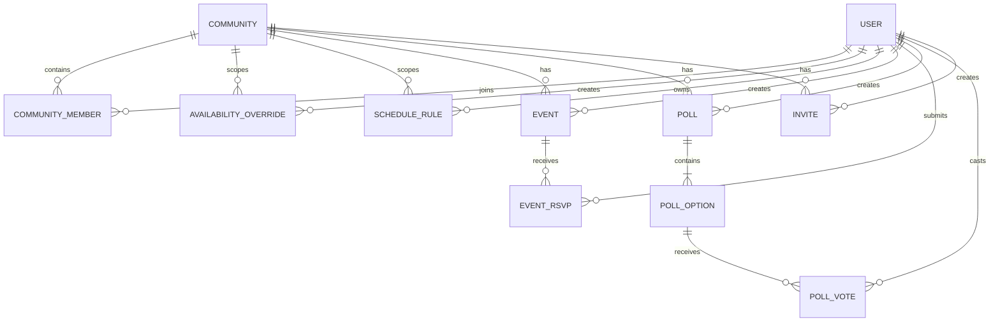
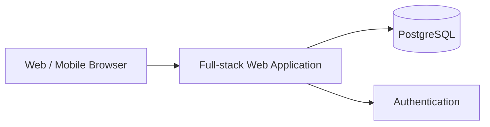

# Especificação de Produto e Implementação — Plataforma da Comunidade

> **Documento mestre para geração da aplicação via Codex**  
> Status: especificação inicial completa para implementação do zero  
> Idioma principal da interface: **Português (Brasil)**  
> Tipo de aplicação: **Web responsiva, mobile-first**  
> Papel deste arquivo: **fonte de verdade funcional e técnica para a primeira versão do produto**

---

## 1. Instruções diretas para o Codex

Você está implementando uma aplicação web do zero a partir desta especificação.

### 1.1 Objetivo da execução

Entregar uma aplicação funcional, testada e pronta para desenvolvimento local, contendo:

- autenticação;
- gestão de comunidade e membros;
- calendário pessoal de disponibilidade/folgas;
- escalas recorrentes de trabalho;
- calendário consolidado do grupo;
- cálculo dos melhores dias em comum;
- eventos e confirmação de presença;
- votações;
- dashboard da comunidade;
- perfis básicos;
- estrutura preparada para módulos futuros de games, geradores aleatórios, caronas, custos e gamificação.

### 1.2 Regras de implementação

1. Não implementar apenas mockups estáticos.
2. Toda funcionalidade principal deve persistir dados em banco.
3. A aplicação deve funcionar localmente com dados de demonstração.
4. Criar migrations e seed do banco.
5. Incluir testes unitários e de integração das principais regras de negócio.
6. Incluir testes end-to-end para os fluxos críticos.
7. Priorizar código legível, modular e fortemente tipado.
8. Não duplicar regras de negócio entre frontend e backend.
9. Validar inputs tanto no cliente quanto no servidor.
10. Implementar autorização no servidor; nunca depender apenas de esconder elementos da UI.
11. Utilizar timezone de forma explícita e consistente.
12. Não armazenar tokens, senhas ou secrets no código.
13. Criar `.env.example` completo.
14. Incluir um `README.md` com setup, execução, testes e arquitetura.
15. Quando houver ambiguidade, seguir o comportamento mais simples que preserve extensibilidade futura.
16. Evitar overengineering no MVP.
17. Não adicionar funcionalidades fora desta especificação sem necessidade técnica clara.
18. Se uma biblioteca específica estiver obsoleta no momento da implementação, substituí-la por equivalente estável e documentar a decisão.

### 1.3 Definição de pronto

O projeto só deve ser considerado pronto quando:

- instala dependências sem erros;
- sobe banco e aplicação localmente;
- migrations executam corretamente;
- seed cria dados de exemplo;
- login funciona;
- os fluxos críticos descritos neste documento funcionam ponta a ponta;
- lint passa;
- typecheck passa;
- testes automatizados passam;
- build de produção passa;
- não existem erros críticos no console do navegador;
- a aplicação é utilizável em desktop e mobile.

---

# 2. Visão do produto

## 2.1 Conceito

A aplicação será um **hub privado para uma comunidade de amigos**, atualmente organizada principalmente através de grupos de WhatsApp.

O objetivo não é substituir o WhatsApp como ferramenta de conversa, e sim resolver atividades que ficam ruins ou desorganizadas dentro de chats:

- descobrir quando várias pessoas estão livres ao mesmo tempo;
- organizar escalas e folgas;
- planejar passeios;
- criar eventos;
- votar em datas, destinos ou atividades;
- acompanhar quem vai participar;
- visualizar próximos compromissos do grupo;
- futuramente organizar games, geradores aleatórios para grupos, caronas, divisão de custos e estatísticas da comunidade.

## 2.2 Proposta de valor

A pergunta central que a plataforma deve responder é:

> **“Quando estamos livres e o que podemos fazer juntos?”**

A aplicação deve conectar quatro conceitos principais:

1. pessoas;
2. disponibilidade;
3. eventos;
4. votações.

---

# 3. Princípios de produto

## 3.1 WhatsApp continua sendo o canal de conversa

A plataforma não deve implementar chat no MVP.

Ela deve complementar o WhatsApp oferecendo páginas compartilháveis para eventos, votações e calendário.

## 3.2 Mobile-first

A maioria dos acessos provavelmente ocorrerá a partir de links enviados no WhatsApp.

A experiência mobile é prioritária.

## 3.3 Baixa fricção

Registrar uma folga, confirmar presença ou votar deve exigir poucos toques.

## 3.4 Privacidade por padrão

A plataforma é voltada a comunidades privadas.

Dados pessoais e calendários não devem ficar publicamente indexáveis.

## 3.5 Gamificação opcional

Gamificação pode existir futuramente, porém não deve bloquear nem poluir a experiência principal.

---

# 4. Escopo do MVP

## 4.1 Incluído no MVP

### Conta e autenticação

- cadastro somente por convite válido, sem vínculo obrigatório com e-mail;
- código secreto de bootstrap aceito exclusivamente para a primeira conta de uma instalação vazia;
- confirmação de senha obrigatória no cadastro;
- login;
- logout;
- recuperação de senha, se o mecanismo de autenticação escolhido suportar facilmente;
- nome de exibição;
- avatar opcional.

### Comunidades

- criar comunidade;
- entrar em comunidade por convite;
- visualizar membros;
- papéis básicos de administrador e membro.

### Disponibilidade

- marcar um dia inteiro como disponível;
- marcar um dia inteiro como indisponível;
- marcar períodos do dia;
- registrar trabalho;
- registrar folga;
- registrar férias;
- criar escala recorrente;
- visualizar calendário individual;
- visualizar calendário consolidado da comunidade.

### Inteligência de disponibilidade

- contar membros disponíveis por dia;
- ordenar melhores datas;
- filtrar por período;
- filtrar por número mínimo de pessoas;
- calcular disponibilidade por intervalo de datas;
- sugerir os melhores dias para criar um evento.

### Eventos

- criar evento;
- editar evento;
- cancelar evento;
- confirmar presença;
- marcar “talvez”;
- recusar participação;
- mostrar lista de participantes;
- associar localização, horário, descrição e custo estimado.

### Votações

- criar enquete;
- escolha única;
- múltipla escolha;
- votação de datas;
- prazo opcional;
- resultado em tempo real;
- opção para permitir ou impedir alteração de voto.

### Dashboard

- próximos eventos;
- votações abertas;
- melhores datas futuras;
- resumo rápido da comunidade.

### Compartilhamento

- botão “Compartilhar no WhatsApp” ou compartilhamento nativo do navegador;
- texto amigável para evento;
- texto amigável para votação;
- link profundo para a página correspondente.

## 4.2 Fora do MVP

Não implementar na primeira versão, mas manter arquitetura preparada para:

- chat;
- notificações push avançadas;
- integração oficial com API do WhatsApp;
- sincronização com Google Calendar/Outlook;
- pagamentos;
- rateio financeiro;
- caronas;
- biblioteca completa de jogos;
- ranking de games;
- times balanceados;
- conquistas;
- estatísticas históricas avançadas;
- upload de álbum de fotos;
- feed social;
- mapa avançado;
- recomendação automática de locais externos;
- sistema público de descoberta de comunidades.

---

# 5. Personas e papéis

## 5.1 Administrador da comunidade

Pode:

- editar informações da comunidade;
- convidar membros;
- remover membros;
- promover/rebaixar administradores;
- criar/editar/cancelar qualquer evento;
- moderar votações;
- consultar dados consolidados da comunidade.

## 5.2 Membro

Pode:

- editar o próprio perfil;
- editar a própria disponibilidade;
- criar eventos, salvo configuração futura em contrário;
- criar votações;
- votar;
- responder a eventos;
- visualizar informações da comunidade.

## 5.3 Regra de segurança

Um usuário só pode acessar dados de comunidades das quais é membro.

---

# 6. Fluxos principais

## 6.1 Primeiro acesso

1. Usuário abre a aplicação.
2. Cria conta por um convite válido ou autentica em uma conta existente.
3. Pode:
   - criar uma nova comunidade; ou
   - entrar através de um convite.
4. Completa nome de exibição e avatar opcional.
5. Acessa dashboard.

## 6.2 Configurar escala de trabalho

1. Usuário abre “Minha agenda”.
2. Seleciona “Adicionar escala”.
3. Escolhe tipo de escala.
4. Define data inicial.
5. Define padrão.
6. Visualiza prévia.
7. Confirma.
8. Sistema gera ocorrências futuras de forma calculada ou persistida conforme decisão de arquitetura.

## 6.3 Encontrar melhor data

1. Usuário abre calendário da comunidade.
2. Escolhe intervalo, por exemplo “próximos 60 dias”.
3. Sistema calcula quantidade de membros disponíveis em cada data.
4. Sistema mostra melhores datas ordenadas.
5. Usuário seleciona uma data.
6. Pode criar um evento ou votação diretamente daquela data.

## 6.4 Criar evento

1. Usuário seleciona “Novo evento”.
2. Preenche título, descrição, data, horário e local.
3. Opcionalmente informa custo aproximado e limite de participantes.
4. Publica.
5. Evento aparece no dashboard.
6. Membros podem responder “Vou”, “Talvez” ou “Não vou”.
7. Quando houver custo estimado, a página mostra a estimativa por participante confirmado (`GOING`),
   recalculada conforme os RSVPs, sem criar cobranças ou registrar pagamentos.

## 6.5 Criar votação

1. Usuário abre “Votações”.
2. Cria votação.
3. Escolhe tipo.
4. Adiciona opções.
5. Define prazo opcional.
6. Publica.
7. Membros votam.
8. Resultados são atualizados.

## 6.6 Votar em datas sugeridas

1. Usuário inicia votação do tipo “datas”.
2. O sistema oferece datas com maior sobreposição de disponibilidade.
3. O criador seleciona datas candidatas.
4. Membros votam.
5. Resultado exibe votos e, separadamente, quantidade de pessoas já marcadas como disponíveis em cada data.

---

# 7. Navegação principal

Mobile:

- Início
- Agenda
- Eventos
- Votações
- Mais

Desktop:

- Dashboard
- Calendário
- Eventos
- Votações
- Membros
- Configurações

Menu de usuário:

- Meu perfil
- Minha disponibilidade
- Trocar de comunidade
- Sair

---

# 8. Dashboard

O dashboard deve responder rapidamente:

- qual é o próximo evento?
- existem votações abertas?
- quais são os melhores próximos dias para o grupo?
- quantas pessoas estão disponíveis no próximo fim de semana?

## 8.1 Blocos sugeridos

### Próxima melhor data

Exemplo:

```text
19 de setembro
11 de 14 pessoas disponíveis
```

Ações:

- ver detalhes;
- criar evento;
- criar votação.

### Próximos eventos

Mostrar próximos 3 a 5 eventos.

### Votações abertas

Mostrar até 3 votações com prazo ou participação.

### Disponibilidade dos próximos 7 dias

Gráfico ou cards simples com contagem diária.

---

# 9. Disponibilidade e calendário

## 9.1 Tipos de status

Criar enum equivalente a:

```text
AVAILABLE
PARTIALLY_AVAILABLE
WORKING
DAY_OFF
VACATION
UNAVAILABLE
UNKNOWN
```

`UNKNOWN` significa que o usuário não informou nada.

Não tratar `UNKNOWN` automaticamente como disponível.

## 9.2 Períodos do dia

Suportar:

- dia inteiro;
- manhã;
- tarde;
- noite;
- intervalo personalizado opcional.

Estrutura recomendada:

```text
start_at
end_at
all_day
status
```

## 9.3 Prioridade de ocorrências

Caso uma escala recorrente gere “WORKING”, mas o usuário adicione manualmente “DAY_OFF” naquela data, o registro manual deve prevalecer.

Ordem conceitual:

```text
manual override > recurrence rule > unknown
```

## 9.4 Escalas recorrentes

Suportar inicialmente:

### Semanal

Exemplos:

- trabalha segunda a sexta;
- folga sábado e domingo;
- trabalha apenas segunda, quarta e sexta.

### Alternância N por M

Exemplos:

- 12x36;
- 4x2;
- 5x1;
- 6x1.

Modelo genérico:

```text
work_days = N
rest_days = M
anchor_date = data inicial do ciclo
```

A aplicação deve calcular o estado de uma determinada data pela posição no ciclo.

## 9.5 Calendário consolidado

Cada dia deve exibir:

- total de membros;
- disponíveis;
- parcialmente disponíveis;
- trabalhando;
- indisponíveis;
- sem informação.

Ao abrir o dia, listar membros agrupados por estado.

## 9.6 Cálculo de score da data

No MVP usar regra simples e transparente.

Exemplo:

```text
available = 1.0
partially_available = 0.5
day_off = 1.0
vacation = 1.0
working = 0.0
unavailable = 0.0
unknown = 0.0
```

Score:

```text
sum(member_score)
```

Também exibir a contagem absoluta de pessoas com disponibilidade completa.

Não esconder o cálculo do usuário.

## 9.7 Filtros

- período;
- somente finais de semana;
- mínimo de pessoas;
- período do dia;
- membros específicos, opcional;
- atividade/interesse, preparado para fase futura.

---

# 10. Eventos

## 10.1 Campos

```text
id
title
description
community_id
created_by
starts_at
ends_at
all_day
timezone
location_name
location_address
location_url
estimated_cost
currency
participant_limit
status
created_at
updated_at
```

## 10.2 Status

```text
DRAFT
PUBLISHED
CANCELLED
COMPLETED
```

No MVP, `DRAFT` pode ser omitido da UI se simplificar a entrega.

## 10.3 RSVP

Enum:

```text
GOING
MAYBE
NOT_GOING
```

Cada membro possui no máximo uma resposta por evento.

Nova resposta substitui a anterior.

## 10.4 Limite de participantes

Se houver limite:

- mostrar vagas restantes;
- não impedir automaticamente RSVP “GOING” no MVP sem definição adicional de lista de espera;
- opcionalmente alertar que o limite foi atingido.

Uma futura versão poderá implementar fila de espera.

## 10.5 Compartilhamento

Gerar texto semelhante a:

```text
🏃 Corrida no Parque
📅 30/08 às 08:00
📍 Parque X
👥 6 confirmados

Confirme sua presença:
<URL>
```

Usar Web Share API quando disponível e fallback para URL do WhatsApp.

---

# 11. Votações

## 11.1 Tipos

Enum:

```text
SINGLE_CHOICE
MULTIPLE_CHOICE
DATE_OPTIONS
```

## 11.2 Campos

```text
id
community_id
created_by
title
description
type
allow_vote_change
closes_at
status
created_at
updated_at
```

## 11.3 Opções

```text
id
poll_id
label
sort_order
date_value nullable
metadata nullable
```

## 11.4 Votos

Para escolha única:

- um voto ativo por usuário.

Para múltipla escolha:

- uma relação usuário/opção por opção selecionada.

## 11.5 Resultado

Mostrar:

- total de votantes;
- votos por opção;
- percentual;
- participantes que votaram, salvo futura configuração de anonimato.

No MVP, votações não são anônimas.

## 11.6 Votação de datas

Além dos votos, mostrar:

- quantidade de membros disponíveis naquela data;
- quantidade sem informação;
- score de disponibilidade.

Isso é uma feature importante do produto.

---

# 12. Perfis e membros

## 12.1 Perfil básico

Campos:

```text
id
name
email
avatar_url
timezone
created_at
updated_at
```

## 12.2 Perfil dentro da comunidade

Campos:

```text
user_id
community_id
display_name optional
role
joined_at
```

Roles:

```text
OWNER
ADMIN
MEMBER
```

## 12.3 Dados opcionais futuros

Reservar possibilidade de adicionar:

- interesses;
- plataformas de games;
- IDs de Steam/PSN/Xbox/etc.;
- jogos;
- preferências de atividades;
- disponibilidade padrão.

Não implementar agora se não for necessário.

---

# 13. Convites

## 13.1 Fluxo

Administrador gera link de convite.

Exemplo conceitual:

```text
/join/<token>
```

Token deve:

- ser não previsível;
- possuir expiração opcional;
- poder ser revogado;
- opcionalmente ter limite de usos.

Somente `OWNER` e `ADMIN` podem gerar ou revogar convites. O convite não precisa ser vinculado a um
e-mail específico e autoriza tanto a criação da conta quanto a entrada na comunidade. A criação do
usuário, da membership e o consumo de um uso do convite devem ocorrer na mesma transação.

Em uma instalação vazia, a primeira conta pode ser criada com um código secreto configurado por
variável de ambiente. Esse bootstrap deixa de ser aceito assim que existir qualquer usuário.

## 13.2 Comportamento

Usuário não autenticado:

1. abre convite;
2. autentica ou cria conta usando o próprio convite;
3. entra na comunidade.

Usuário autenticado:

1. abre convite;
2. confirma entrada;
3. entra na comunidade.

---

# 14. Modelo de domínio

## 14.1 Entidades principais



---

# 15. Modelo de banco de dados recomendado

Banco recomendado: PostgreSQL.

## 15.1 users

```text
id UUID PK
email CITEXT/unique
name VARCHAR
avatar_url TEXT nullable
timezone VARCHAR default America/Sao_Paulo
created_at TIMESTAMPTZ
updated_at TIMESTAMPTZ
```

Se a biblioteca de autenticação utilizar tabelas próprias, adaptar sem duplicar dados desnecessariamente.

## 15.2 communities

```text
id UUID PK
name VARCHAR
slug VARCHAR unique
description TEXT nullable
avatar_url TEXT nullable
created_by UUID FK users
created_at TIMESTAMPTZ
updated_at TIMESTAMPTZ
```

## 15.3 community_members

```text
community_id UUID FK communities
user_id UUID FK users
role ENUM OWNER|ADMIN|MEMBER
joined_at TIMESTAMPTZ
PRIMARY KEY (community_id, user_id)
```

## 15.4 invites

```text
id UUID PK
community_id UUID FK
token_hash TEXT unique
created_by UUID FK
expires_at TIMESTAMPTZ nullable
max_uses INTEGER nullable
use_count INTEGER default 0
revoked_at TIMESTAMPTZ nullable
created_at TIMESTAMPTZ
```

Nunca persistir token sensível em texto puro caso um hash seja suficiente.

## 15.5 schedule_rules

```text
id UUID PK
community_id UUID FK
user_id UUID FK
name VARCHAR
rule_type ENUM WEEKLY|CYCLE
anchor_date DATE nullable
work_days INTEGER nullable
rest_days INTEGER nullable
weekly_pattern JSONB nullable
start_date DATE
end_date DATE nullable
status ENUM ACTIVE|INACTIVE
created_at TIMESTAMPTZ
updated_at TIMESTAMPTZ
```

Exemplo `weekly_pattern`:

```json
{
  "monday": "WORKING",
  "tuesday": "WORKING",
  "wednesday": "WORKING",
  "thursday": "WORKING",
  "friday": "WORKING",
  "saturday": "DAY_OFF",
  "sunday": "DAY_OFF"
}
```

## 15.6 availability_overrides

```text
id UUID PK
community_id UUID FK
user_id UUID FK
start_at TIMESTAMPTZ
end_at TIMESTAMPTZ
all_day BOOLEAN
status ENUM
note TEXT nullable
created_at TIMESTAMPTZ
updated_at TIMESTAMPTZ
```

Índices recomendados:

```text
(community_id, start_at)
(user_id, start_at)
```

## 15.7 events

Conforme seção de eventos.

## 15.8 event_rsvps

```text
event_id UUID FK
user_id UUID FK
status ENUM GOING|MAYBE|NOT_GOING
created_at TIMESTAMPTZ
updated_at TIMESTAMPTZ
PRIMARY KEY (event_id, user_id)
```

## 15.9 polls

Conforme seção de votações.

## 15.10 poll_options

Conforme seção de votações.

## 15.11 poll_votes

```text
id UUID PK
poll_id UUID FK
option_id UUID FK
user_id UUID FK
created_at TIMESTAMPTZ
UNIQUE (option_id, user_id)
```

Garantir regras adicionais para `SINGLE_CHOICE` na camada de domínio/transação.

---

# 16. Arquitetura recomendada

## 16.1 Estratégia

Para o MVP, utilizar **monólito modular full-stack**.

Evitar microserviços.

Arquitetura conceitual:



## 16.2 Stack sugerida

Preferência:

- TypeScript;
- framework React full-stack moderno;
- PostgreSQL;
- ORM fortemente tipado;
- validação de schema;
- autenticação consolidada;
- CSS utility-first ou design system equivalente;
- biblioteca de componentes acessíveis;
- Playwright para E2E;
- Vitest/Jest equivalente para unitários.

Uma implementação válida seria:

```text
Next.js
TypeScript
PostgreSQL
Prisma ou Drizzle
Auth.js ou solução equivalente
Zod
Tailwind CSS
shadcn/ui ou componentes acessíveis equivalentes
Playwright
Vitest
Docker Compose
```

O Codex pode substituir bibliotecas se houver opção mais estável no momento da implementação, desde que preserve os requisitos.

## 16.3 Estrutura sugerida

```text
src/
  app/
  components/
  features/
    auth/
    communities/
    availability/
    events/
    polls/
    members/
  lib/
    auth/
    db/
    validation/
    dates/
  server/
    services/
    repositories/
    authorization/
  types/

tests/
  unit/
  integration/
  e2e/

prisma/ ou db/
  schema
  migrations/
  seed/
```

Não é obrigatório seguir exatamente os nomes, mas manter separação modular equivalente.

---

# 17. Backend e regras de domínio

## 17.1 Serviços sugeridos

Criar serviços de domínio equivalentes a:

```text
CommunityService
MembershipService
AvailabilityService
ScheduleService
AvailabilityScoringService
EventService
PollService
InviteService
```

## 17.2 Authorization helpers

Exemplos:

```text
requireAuthenticatedUser()
requireCommunityMember(communityId)
requireCommunityAdmin(communityId)
requireCommunityOwner(communityId)
```

Todas as mutações devem verificar autorização no servidor.

## 17.3 Transações

Usar transações em operações como:

- entrada por convite;
- criação/substituição de voto;
- alteração de role;
- transferência futura de ownership;
- RSVP quando houver regras de limite;
- exclusões encadeadas sensíveis.

---

# 18. API / Actions

A implementação pode utilizar REST, route handlers, server actions ou RPC tipado.

O importante é manter contratos claros.

## 18.1 Contratos mínimos

### Comunidades

```text
createCommunity
getCommunity
listMyCommunities
updateCommunity
listCommunityMembers
removeMember
updateMemberRole
```

### Convites

```text
createInvite
getInvitePreview
acceptInvite
revokeInvite
```

### Disponibilidade

```text
createAvailabilityOverride
updateAvailabilityOverride
deleteAvailabilityOverride
getMyCalendar
getCommunityCalendar
getBestDates
```

### Escalas

```text
createScheduleRule
updateScheduleRule
deleteScheduleRule
previewScheduleRule
```

### Eventos

```text
createEvent
updateEvent
cancelEvent
getEvent
listUpcomingEvents
setRsvp
```

### Votações

```text
createPoll
updatePoll
closePoll
getPoll
listOpenPolls
castVote
removeVote
```

---

# 19. Lógica de cálculo de escala

## 19.1 Ciclo N x M

Para uma regra com:

```text
work_days = N
rest_days = M
anchor_date = D
```

Calcular:

```text
cycle_length = N + M
delta = days_between(D, target_date)
position = modulo(delta, cycle_length)
```

Se:

```text
position < N
```

estado = `WORKING`.

Caso contrário:

estado = `DAY_OFF`.

Deve funcionar também para datas posteriores e, se possível, anteriores à âncora usando módulo matemático normalizado.

## 19.2 Regra semanal

Resolver pelo dia da semana e `weekly_pattern`.

## 19.3 Override

Antes de retornar status calculado, verificar override manual aplicável.

---

# 20. Cálculo de melhores datas

Criar função de domínio pura e testável.

Entrada conceitual:

```ts
getBestDates({
  communityId,
  startDate,
  endDate,
  minPeople,
  onlyWeekends,
  periodOfDay,
});
```

Saída conceitual:

```ts
[
  {
    date: "2026-09-19",
    fullAvailableCount: 11,
    partialAvailableCount: 1,
    unavailableCount: 2,
    unknownCount: 0,
    score: 11.5,
    totalMembers: 14,
  },
];
```

Ordenação padrão:

1. score desc;
2. fullAvailableCount desc;
3. unknownCount asc;
4. date asc.

---

# 21. Timezone e datas

Datas são críticas neste produto.

## 21.1 Regras

- armazenar timestamps em UTC;
- armazenar timezone IANA do usuário/comunidade quando necessário;
- converter para timezone de exibição;
- datas de escala que representam “dia civil” devem utilizar tipo `DATE`, não timestamp;
- não assumir que todo usuário está sempre no mesmo timezone;
- default inicial aceitável: `America/Sao_Paulo`.

## 21.2 Testes obrigatórios

Testar:

- virada de mês;
- virada de ano;
- fevereiro;
- ano bissexto;
- timezone;
- eventos que atravessam meia-noite;
- intervalo de disponibilidade parcial.

---

# 22. UX/UI

## 22.1 Estilo

A interface deve ser:

- limpa;
- moderna;
- informal sem parecer infantil;
- rápida;
- otimizada para uso entre amigos;
- acessível;
- responsiva.

A identidade visual deve oferecer os temas Juntaê, Clássico, Solar e Oceano. A escolha do usuário
deve ser persistida localmente e aplicada antes da renderização para evitar troca perceptível de
paleta durante o carregamento.

## 22.2 Componentes importantes

- cards;
- tabs;
- calendário mensal;
- calendário/lista mobile;
- badges de status;
- avatars agrupados;
- progress bars de votação;
- bottom navigation mobile;
- dialogs/sheets;
- toast de feedback;
- skeleton loading;
- empty states.

## 22.3 Cores de status

Não depender exclusivamente de cor.

Cada status deve possuir texto/ícone além da cor.

## 22.4 Empty states

Exemplo para eventos:

```text
Nenhum evento marcado ainda.
Crie o primeiro encontro do grupo.
```

Exemplo para disponibilidade:

```text
Você ainda não configurou sua agenda.
Adicione suas folgas ou sua escala de trabalho.
```

---

# 23. Telas necessárias

## 23.1 Públicas

- Login
- Cadastro por convite; acesso direto informa que a instância é privada
- Recuperação de senha, se aplicável
- Aceitar convite

## 23.2 Autenticadas

### Dashboard

`/app/[community]/`

### Minha agenda

`/app/[community]/agenda/me`

### Agenda da comunidade

`/app/[community]/agenda`

### Escalas

`/app/[community]/agenda/schedules`

### Eventos

`/app/[community]/events`

### Evento

`/app/[community]/events/[eventId]`

### Novo evento

`/app/[community]/events/new`

### Votações

`/app/[community]/polls`

### Votação

`/app/[community]/polls/[pollId]`

### Nova votação

`/app/[community]/polls/new`

### Membros

`/app/[community]/members`

### Configurações da comunidade

`/app/[community]/settings`

### Perfil

`/settings/profile`

Os paths são sugestivos e podem ser adaptados.

---

# 24. Dashboard — wireframe conceitual

```text
┌────────────────────────────────────────────┐
│ Comunidade                     Avatar      │
├────────────────────────────────────────────┤
│                                            │
│ PRÓXIMA MELHOR DATA                        │
│ 19 Setembro                                │
│ 11/14 disponíveis                          │
│ [Ver detalhes] [Criar evento]              │
│                                            │
├──────────────────┬─────────────────────────┤
│ PRÓXIMOS EVENTOS │ VOTAÇÕES ABERTAS       │
│                  │                         │
│ Corrida          │ Próxima viagem         │
│ Dom 08:00        │ Brotas      42%         │
│ 6 confirmados    │ Paraty      35%         │
│                  │                         │
│ Game Night       │                         │
│ Sex 21:00        │                         │
│ 8 confirmados    │                         │
├──────────────────┴─────────────────────────┤
│ DISPONIBILIDADE — PRÓXIMOS 7 DIAS          │
│ S  T  Q  Q  S  S  D                       │
│ 4  5  5  7  9  12 11                      │
└────────────────────────────────────────────┘
```

No mobile, transformar blocos em cards verticais.

---

# 25. Requisitos não funcionais

## 25.1 Performance

- dashboard deve carregar rapidamente;
- paginação onde listas possam crescer;
- evitar N+1 queries;
- calcular scores de forma eficiente;
- utilizar cache quando seguro e útil;
- não pré-calcular anos inteiros de escalas sem necessidade.

## 25.2 Segurança

- autenticação segura;
- cookies seguros quando aplicável;
- CSRF conforme arquitetura;
- rate limiting em endpoints sensíveis;
- validação de input;
- autorização server-side;
- escape/sanitização apropriados;
- proteção contra IDOR;
- token de convite não previsível;
- secrets apenas em environment variables;
- dependências atualizadas.

## 25.3 Privacidade

- páginas internas devem exigir autenticação;
- não disponibilizar calendários publicamente;
- não expor emails desnecessariamente para todos os membros;
- links de convite não devem revelar informações sensíveis antes da validação.

## 25.4 Acessibilidade

Objetivo: boas práticas WCAG.

- navegação por teclado;
- labels;
- focus states;
- contraste adequado;
- aria attributes quando necessários;
- não depender apenas de hover.

## 25.5 Observabilidade

No mínimo:

- logs estruturados server-side;
- erros não devem expor stack trace para o usuário final;
- preparar ponto de integração futura com monitoramento de erros.

---

# 26. PWA

Desejável, mas não obrigatório para primeiro commit funcional.

Preparar arquitetura para:

- manifest;
- ícone;
- instalação na home screen;
- service worker futuro;
- notificações push futuras.

Não bloquear o MVP por PWA.

---

# 27. Dados de demonstração / seed

Criar comunidade:

```text
Juntaê
```

Criar pelo menos 8 usuários de demonstração.

Criar diferentes escalas:

- segunda a sexta;
- 12x36;
- 4x2;
- sem escala;
- férias;
- overrides manuais.

Criar pelo menos:

- 3 eventos futuros;
- 1 evento passado;
- 3 votações abertas;
- 1 votação encerrada;
- RSVPs variados;
- votos variados.

O dashboard após seed deve parecer vivo e permitir testar a plataforma imediatamente.

---

# 28. Testes obrigatórios

## 28.1 Unitários

### ScheduleService

- weekly pattern;
- 12x36;
- 4x2;
- mudança de mês;
- mudança de ano;
- data anterior à âncora;
- override manual.

### AvailabilityScoringService

- full availability;
- partial;
- unknown;
- ordenação;
- filtro de fim de semana;
- mínimo de participantes.

### PollService

- escolha única;
- troca de voto;
- votação múltipla;
- votação encerrada;
- usuário não membro.

### EventService

- RSVP;
- alteração de RSVP;
- evento cancelado;
- autorização.

## 28.2 Integração

Testar:

- criação de comunidade;
- convite e entrada;
- persistência de escala;
- criação de evento;
- votação;
- consulta de calendário consolidado.

## 28.3 End-to-end

Fluxos críticos:

### E2E 1

```text
cadastro/login
→ criar comunidade
→ convidar/seed de membros
→ abrir dashboard
```

### E2E 2

```text
configurar escala 12x36
→ abrir calendário
→ validar dias de trabalho e folga
→ criar override
→ validar override
```

### E2E 3

```text
ver melhores datas
→ selecionar data
→ criar evento
→ responder RSVP
```

### E2E 4

```text
criar votação de datas
→ votar
→ alterar voto
→ visualizar resultado
```

---

# 29. Critérios de aceite do MVP

## 29.1 Autenticação

- [ ] Usuário consegue entrar e sair.
- [ ] Usuário não autenticado não acessa páginas internas.
- [ ] Cadastro sem convite é recusado após a criação da primeira conta.
- [ ] Convite válido cria a conta e adiciona o usuário à comunidade atomicamente.
- [ ] Cadastro exige que senha e confirmação de senha sejam iguais.

## 29.2 Comunidade

- [ ] Usuário cria uma comunidade.
- [ ] Usuário entra por convite.
- [ ] Membro não acessa outra comunidade sem permissão.

## 29.3 Disponibilidade

- [ ] Usuário registra uma folga.
- [ ] Usuário registra indisponibilidade.
- [ ] Usuário cria uma escala recorrente.
- [ ] Override manual prevalece sobre escala.
- [ ] Calendário da comunidade consolida membros corretamente.

## 29.4 Melhores datas

- [ ] Sistema mostra datas ordenadas por disponibilidade.
- [ ] Contagens conferem com dados dos membros.
- [ ] Usuário consegue filtrar finais de semana.

## 29.5 Eventos

- [ ] Evento pode ser criado.
- [ ] Evento aparece no dashboard.
- [ ] Usuário consegue responder GOING/MAYBE/NOT_GOING.
- [ ] Contagens atualizam corretamente.
- [ ] Custo estimado por confirmado é exibido e atualizado conforme os RSVPs.

## 29.6 Votações

- [ ] Votação simples funciona.
- [ ] Votação múltipla funciona.
- [ ] Votação de datas funciona.
- [ ] Resultado mostra votos corretamente.
- [ ] Votação encerrada não aceita novos votos.

## 29.7 Responsividade

- [ ] Principais fluxos são utilizáveis em largura mobile.
- [ ] Principais fluxos são utilizáveis em desktop.

## 29.8 Engenharia

- [ ] Lint passa.
- [ ] Typecheck passa.
- [ ] Testes passam.
- [ ] Build de produção passa.

---

# 30. Backlog pós-MVP

## 30.1 Módulo Games

Perfis podem cadastrar:

- Steam;
- PSN;
- Xbox;
- Riot;
- Battle.net;
- Discord;
- plataforma preferida.

Criar catálogo comunitário de jogos.

Features futuras:

- “Quem joga este jogo?”;
- “O que podemos jogar hoje?”;
- Game Night;
- sorteio de times utilizando o módulo genérico de Geradores Aleatórios;
- balanceamento por nível;
- ranking interno;
- histórico de partidas.

## 30.2 Caronas

Evento pode ter:

```text
driver
vehicle
seats_available
origin
meeting_point
```

Membros solicitam vaga.

## 30.3 Custos

Evento pode registrar despesas.

Exemplo:

```text
combustível
pedágio
hospedagem
ingressos
alimentação
```

Sistema calcula rateio.

## 30.4 Interesses

Membro pode marcar:

- corrida;
- bike;
- trilha;
- viagem;
- churrasco;
- boardgames;
- games;
- cinema;
- outros.

Futuramente cruzar disponibilidade + interesses.

## 30.5 Sugestão “O que podemos fazer?”

Tela futura:

```text
Este final de semana
9 pessoas disponíveis

6 interessadas em corrida
5 em trilha
7 em Game Night
8 em churrasco
```

Ações:

- criar votação;
- criar evento.

## 30.6 Gamificação

Conquistas opcionais:

```text
10 corridas
5 trilhas
20 Game Nights
3 viagens
10 eventos organizados
```

## 30.7 Retrospectiva anual

Exemplo:

```text
2026
47 encontros
16 corridas
8 trilhas
5 viagens
21 Game Nights
```

## 30.8 Geradores Aleatórios para Grupos

Criar um módulo genérico chamado **Geradores** ou **Sorteios**, reutilizável por toda a comunidade.

O objetivo não é implementar apenas um sorteador de nomes, mas um pequeno **motor de distribuição aleatória com restrições opcionais**, capaz de resolver situações sociais comuns sem exigir planilhas ou aplicativos externos.

### 30.8.1 Princípio de produto

O usuário deve conseguir partir de membros da comunidade, participantes de um evento ou listas digitadas manualmente e obter um resultado em poucos passos.

O fluxo ideal é:

```text
Escolher um tipo de gerador
        ↓
Selecionar/digitar participantes
        ↓
Informar itens, grupos ou recursos se necessário
        ↓
Definir regras opcionais
        ↓
Sortear
        ↓
Ver / compartilhar / sortear novamente
```

O recurso deve ser divertido e extremamente simples no modo básico, porém flexível no modo avançado.

### 30.8.2 Presets iniciais

#### A. Separar pessoas em times

Entrada:

```text
Ana
Bruno
Carlos
Daniel
Eduardo
Fernanda
Gabriel
Helena
```

Configuração:

```text
2 times
```

Saída:

```text
Time 1
Ana
Carlos
Eduardo
Helena

Time 2
Bruno
Daniel
Fernanda
Gabriel
```

Permitir escolher:

- quantidade de times;
- tamanho máximo por time;
- nomes customizados dos times;
- pessoas fixas em times diferentes, quando desejado;
- capitães opcionais;
- sorteio puramente aleatório;
- futuramente, balanceamento por skill/ranking para games.

#### B. Separar pessoas em grupos de N

Exemplo:

```text
12 pessoas
→ grupos de 4
→ 3 grupos
```

Se o número não for divisível exatamente, distribuir a diferença da forma mais uniforme possível.

Exemplo:

```text
10 pessoas em grupos de até 4
→ 4 + 3 + 3
```

Nunca produzir um grupo vazio.

#### C. Distribuir pessoas entre carros / motoristas

Entrada:

```text
Motoristas:
João — 4 vagas para passageiros
Maria — 3 vagas para passageiros
Pedro — 4 vagas para passageiros

Passageiros:
8 pessoas
```

O sistema distribui os passageiros aleatoriamente respeitando a capacidade de cada veículo.

Regras opcionais futuras:

- passageiro precisa ir com determinado motorista;
- duas pessoas devem ficar juntas;
- duas pessoas não devem ficar no mesmo carro;
- preferência por origem/região;
- motorista também conta ou não na capacidade, conforme configuração explícita.

No preset padrão de carona, `vagas` deve significar **vagas disponíveis para passageiros**, evitando ambiguidade.

Se não houver capacidade suficiente, o sistema deve bloquear o sorteio e informar claramente quantas vagas faltam.

#### D. Distribuir itens entre pessoas

Exemplo:

```text
Pessoas:
Ana
Bruno
Carlos
Daniel

Pratos:
Pizza
Hambúrguer
Sushi
Lasanha
```

Resultado possível:

```text
Ana → Sushi
Bruno → Pizza
Carlos → Lasanha
Daniel → Hambúrguer
```

Este preset pode servir para:

- comidas;
- bebidas;
- tarefas;
- presentes;
- personagens;
- posições;
- desafios;
- responsabilidades;
- qualquer lista arbitrária de itens.

Por padrão, cada item é usado no máximo uma vez.

Permitir futuramente configurar itens como reutilizáveis quando fizer sentido.

#### E. Escolher uma pessoa aleatoriamente

Exemplos:

```text
Quem começa?
Quem escolhe o filme?
Quem vai buscar a comida?
Quem será o capitão?
```

Permitir escolher uma ou várias pessoas.

#### F. Escolher um item aleatoriamente

Exemplos:

```text
Qual restaurante?
Qual jogo?
Qual filme?
Qual atividade?
Qual destino?
```

Pode receber uma lista manual ou, futuramente, dados internos como jogos cadastrados e opções de uma votação.

#### G. Gerar uma ordem aleatória

Exemplos:

```text
ordem de escolha
ordem de jogo
ordem de apresentação
ordem para utilizar um recurso
```

Resultado:

```text
1. Carlos
2. Ana
3. Fernanda
4. João
```

#### H. Formar duplas

Preset específico de grupos de 2.

Se houver número ímpar de participantes, o sistema deve:

- criar uma dupla e um trio; ou
- deixar uma pessoa sem par;

A UI deve perguntar qual comportamento utilizar antes do sorteio quando houver número ímpar.

### 30.8.3 Fontes de participantes

A lista de participantes não deve precisar ser digitada toda vez.

Permitir selecionar participantes a partir de:

- membros da comunidade;
- participantes confirmados (`GOING`) de um evento;
- confirmados + `MAYBE` de um evento, mediante escolha explícita;
- membros filtrados por interesse;
- participantes de uma Game Night futura;
- seleção manual de membros;
- nomes digitados manualmente sem necessidade de conta.

A arquitetura deve manter o gerador desacoplado da origem dos participantes.

Conceitualmente, o motor recebe apenas uma lista normalizada:

```ts
type RandomizerParticipant = {
  id: string;
  label: string;
  metadata?: Record<string, unknown>;
};
```

### 30.8.4 Regras e restrições

O modo avançado pode permitir regras opcionais como:

- manter duas ou mais pessoas juntas;
- garantir que determinadas pessoas fiquem separadas;
- fixar uma pessoa em determinado grupo;
- definir capitães/líderes;
- definir capacidade diferente por grupo;
- excluir determinados participantes temporariamente;
- impedir que uma pessoa receba determinado item;
- impedir repetição de combinações recentes;
- preservar alguns resultados e sortear novamente apenas os demais.

Restrições devem ser validadas antes do sorteio.

Se as regras forem matematicamente incompatíveis, não gerar um resultado silenciosamente inválido. Exibir uma mensagem explicando o conflito.

Exemplo:

```text
Não é possível criar 2 grupos separados porque Ana, Bruno e Carlos foram configurados para nunca ficarem juntos e existem apenas 2 grupos.
```

### 30.8.5 Aleatoriedade e transparência

O resultado deve ser realmente aleatório dentro das restrições selecionadas.

Implementação recomendada:

- utilizar gerador de números aleatórios criptograficamente seguro quando disponível no runtime;
- evitar `Math.random()` como única fonte em lógica server-side de sorteio persistido;
- não introduzir vieses intencionais no modo “Aleatório”;
- deixar claramente indicado quando um modo futuro for “Balanceado” em vez de aleatório.

O sistema pode gerar um `seed`/identificador do sorteio para auditoria ou reprodução futura, mas isso não é requisito da primeira implementação do módulo.

Este recurso é recreativo e **não deve ser apresentado como mecanismo para apostas, jogos de azar ou decisões de alto risco**.

### 30.8.6 Resultado e interação

Após o sorteio, oferecer:

- `Sortear novamente`;
- `Copiar resultado`;
- `Compartilhar`;
- `Salvar resultado` quando o usuário desejar;
- `Editar participantes`;
- `Editar regras`;
- `Fixar` parte do resultado e sortear novamente o restante, em uma evolução futura.

Exemplo de texto compartilhável:

```text
🎲 Sorteio — Carros para o passeio

🚗 João
• Ana
• Carlos
• Fernanda
• Pedro

🚙 Maria
• Bruno
• Daniela
• Gustavo

Gerado pela plataforma da comunidade.
```

O texto deve ser adequado para copiar e colar no WhatsApp.

### 30.8.7 Histórico

Salvar histórico deve ser opcional.

Um sorteio salvo pode armazenar:

```text
id
community_id
created_by
preset_type
title
configuration_json
input_snapshot_json
result_json
created_at
```

Usar snapshots para que um resultado antigo continue compreensível mesmo se membros mudarem de nome ou saírem da comunidade.

Não é necessário persistir sorteios rápidos quando o usuário não solicitar salvamento.

### 30.8.8 Modelo de domínio futuro

Entidade opcional:

```text
randomizer_runs
---------------
id UUID PK
community_id UUID FK communities.id
created_by UUID FK users.id
preset_type VARCHAR
name VARCHAR nullable
configuration JSONB
input_snapshot JSONB
result JSONB
created_at TIMESTAMPTZ
```

`preset_type` pode inicialmente aceitar:

```text
TEAMS
GROUPS
CARS
ASSIGN_ITEMS
PICK_PEOPLE
PICK_ITEM
RANDOM_ORDER
PAIRS
CUSTOM
```

A lógica de geração deve existir em um serviço de domínio independente, por exemplo:

```text
RandomizerService
```

Evitar espalhar algoritmos diferentes diretamente pelas páginas de UI.

### 30.8.9 Contratos conceituais de serviço

```text
generateRandomResult(input, configuration, constraints)
validateRandomizerConfiguration(input, configuration, constraints)
saveRandomizerRun(result)
listSavedRandomizerRuns(communityId)
getRandomizerRun(id)
deleteRandomizerRun(id)
```

A função de geração deve ser testável de forma independente da interface.

### 30.8.10 Testes futuros obrigatórios

Ao implementar o módulo, incluir testes para no mínimo:

- todos os participantes aparecem exatamente uma vez quando aplicável;
- ninguém aparece em dois times no mesmo sorteio;
- grupos ficam tão equilibrados quanto matematicamente possível;
- capacidade de carros nunca é excedida;
- falta de vagas é detectada antes do sorteio;
- atribuição pessoa → item não repete item quando repetição está desabilitada;
- seleção de N pessoas retorna exatamente N pessoas únicas;
- ordem aleatória contém todos os participantes uma única vez;
- restrição “juntos” é respeitada;
- restrição “separados” é respeitada;
- conflitos impossíveis são rejeitados;
- listas vazias são rejeitadas;
- um único participante funciona nos presets compatíveis;
- nomes duplicados digitados manualmente continuam sendo tratados como entradas distintas internamente;
- resultado salvo preserva snapshot dos dados utilizados.

### 30.8.11 Prioridade

Este módulo é **pós-MVP, porém de alta prioridade**, pois possui:

- implementação relativamente isolada;
- alto valor social/recreativo;
- forte potencial de uso recorrente;
- integração natural com Eventos, Games e Caronas;
- baixo atrito para demonstrar valor da plataforma ao grupo.

Depois que o núcleo de autenticação, comunidade, eventos e disponibilidade estiver estável, este deve ser um dos primeiros módulos adicionais considerados.

---

# 31. Integração futura com calendários externos

Possíveis integrações:

- Google Calendar;
- Microsoft Outlook;
- arquivo ICS.

Privacidade deve permitir importar apenas estado de disponibilidade em vez do conteúdo do evento.

Exemplo:

```text
busy 18:00-20:00
```

sem armazenar:

```text
Consulta médica com Dr. X
```

---

# 32. Integração futura com WhatsApp

## 32.1 MVP

Somente compartilhamento por link/texto.

## 32.2 Futuro

Avaliar API oficial para:

- lembrete de evento;
- encerramento de votação;
- resumo semanal;
- melhores datas do mês.

Não utilizar automação não oficial baseada em scraping de WhatsApp Web.

---

# 33. Possíveis notificações futuras

- novo evento;
- evento alterado;
- evento cancelado;
- lembrete 24h antes;
- nova votação;
- votação encerrando;
- resultado final;
- convite;
- nova data com alta disponibilidade.

Canais possíveis:

- in-app;
- email;
- push;
- WhatsApp oficial futuramente.

---

# 34. Regras de exclusão

Preferir soft delete somente onde houver motivo claro.

Eventos cancelados devem preservar histórico usando status `CANCELLED`.

Para entidades simples ainda sem dependências, hard delete pode ser utilizado.

Exclusão de comunidade deve exigir confirmação forte e cascade controlado.

---

# 35. Auditoria mínima

Registrar `created_at` e `updated_at` nas entidades principais.

Para ações administrativas futuras, preparar estrutura para audit log, porém não é necessário implementar audit log completo no MVP.

---

# 36. Internacionalização

MVP em português do Brasil.

Evitar strings espalhadas em regras de domínio.

Idealmente estruturar UI de forma que i18n futuro seja possível.

Não é necessário implementar múltiplos idiomas agora.

---

# 37. Convenções de código

- TypeScript strict;
- evitar `any`;
- funções pequenas;
- nomes descritivos;
- regras de domínio testáveis isoladamente;
- erros de domínio tipados quando apropriado;
- DTO/schema para entradas externas;
- IDs tratados consistentemente;
- datas manipuladas por biblioteca confiável;
- componentes de UI não devem realizar acesso direto arbitrário ao banco;
- centralizar autorização;
- centralizar enums de domínio.

---

# 38. Environment variables

Criar `.env.example` semelhante a:

```env
DATABASE_URL=
AUTH_SECRET=
REGISTRATION_BOOTSTRAP_TOKEN=
APP_URL=http://localhost:3000
DEFAULT_TIMEZONE=America/Sao_Paulo
```

Adicionar variáveis exigidas pela solução de autenticação selecionada.

Nunca incluir secrets reais no repositório.

---

# 39. Desenvolvimento local

Objetivo:

```bash
cp .env.example .env

docker compose up -d

npm install
npm run db:migrate
npm run db:seed
npm run dev
```

Os comandos exatos podem variar conforme package manager.

Preferir experiência equivalente e documentá-la no README.

---

# 40. Scripts esperados

Criar scripts equivalentes a:

```text
dev
build
start
lint
typecheck
test
test:unit
test:integration
test:e2e
db:migrate
db:seed
db:reset
```

---

# 41. Docker

Fornecer `docker-compose.yml` para desenvolvimento com PostgreSQL.

Opcionalmente containerizar a aplicação, mas não é obrigatório para o MVP desde que o banco local seja simples de iniciar.

---

# 42. CI sugerida

Preparar workflow de CI, preferencialmente GitHub Actions, com:

```text
install
lint
typecheck
unit tests
integration tests
build
```

E2E pode ser etapa separada caso exija ambiente completo.

---

# 43. Performance de consultas

Adicionar índices adequados para:

- community_members por usuário;
- availability por comunidade/data;
- schedule_rules por usuário/comunidade;
- events por comunidade/data;
- polls por comunidade/status;
- votes por poll/user;
- invites por token hash.

Verificar query plans apenas se necessário; não otimizar prematuramente.

---

# 44. Casos de borda

Codex deve considerar explicitamente:

- usuário pertence a múltiplas comunidades;
- comunidade com apenas uma pessoa;
- pessoa sem nenhuma agenda configurada;
- todos os membros sem informação;
- nenhum dia satisfaz `minPeople`;
- escala sem data final;
- override cobrindo apenas parte do dia;
- votação sem votos;
- votação encerrada;
- evento no passado;
- evento cancelado;
- convite expirado;
- convite revogado;
- convite esgotado;
- usuário já pertencente à comunidade;
- owner tentando remover a si próprio;
- último owner da comunidade;
- membro tentando executar ação administrativa;
- race condition de votos/RSVPs;
- datas em timezone diferente.

---

# 45. Decisões explícitas do MVP

Para evitar que a IA fique travada em perguntas de produto, utilizar estas decisões:

1. Uma pessoa pode participar de múltiplas comunidades.
2. Toda comunidade possui exatamente um ou mais owners; nunca permitir ficar sem owner.
3. Qualquer membro pode criar evento no MVP.
4. Qualquer membro pode criar votação no MVP.
5. Votação não é anônima no MVP.
6. `UNKNOWN` não conta como disponível.
7. Override manual prevalece sobre escala.
8. Eventos podem exibir o custo estimado dividido pelos confirmados como informação, mas não
   registram despesas, cobranças, pagamentos ou rateio financeiro no MVP.
9. Não há chat.
10. Não há integração oficial com WhatsApp no MVP.
11. Compartilhamento usa links e Web Share API.
12. Calendário da comunidade só pode ser visto por membros.
13. Dados de trabalho/folga são visíveis aos membros da mesma comunidade.
14. O MVP não exige aprovação manual de novos membros após uso de convite válido.
15. Avatar é opcional.
16. Fotos de evento não fazem parte do MVP.
17. Eventos não possuem lista de espera no MVP.
18. Uma votação de datas utiliza datas civis da comunidade e exibe disponibilidade calculada.
19. Novas contas exigem convite de uma comunidade, sem vínculo obrigatório com e-mail.
20. Apenas `OWNER` e `ADMIN` geram convites; qualquer usuário autenticado pode criar comunidade.
21. A primeira conta de uma instalação vazia exige um código secreto de bootstrap e, depois de
    criada, esse código não autoriza novos cadastros.

---

# 46. Ordem recomendada de implementação

Executar em incrementos funcionais.

## Fase 1 — Fundação

- projeto;
- TypeScript;
- banco;
- ORM;
- migrations;
- autenticação;
- layout;
- testes base;
- Docker Compose.

## Fase 2 — Comunidades

- communities;
- membership;
- roles;
- convites;
- autorização.

## Fase 3 — Disponibilidade

- overrides;
- calendário pessoal;
- regras semanais;
- ciclo N x M;
- testes de cálculo.

## Fase 4 — Calendário consolidado

- visão da comunidade;
- scoring;
- melhores datas;
- filtros.

## Fase 5 — Eventos

- CRUD;
- RSVP;
- dashboard.

## Fase 6 — Votações

- single;
- multiple;
- date options;
- resultados.

## Fase 7 — Compartilhamento e UX

- WhatsApp/share;
- empty states;
- mobile polish;
- loading/error states.

## Fase 8 — Qualidade

- E2E;
- CI;
- revisão de segurança;
- build de produção;
- documentação final.

---

# 47. Entregáveis esperados do Codex

Ao terminar, o repositório deve conter, no mínimo:

```text
README.md
.env.example
package.json
lockfile
src/
tests/
db schema ou prisma/
migrations/
seed/
docker-compose.yml
CI workflow
```

E a aplicação funcional.

---

# 48. README esperado

O README gerado pelo Codex deve conter:

- descrição do produto;
- screenshots opcionais;
- requisitos;
- instalação;
- environment variables;
- banco;
- migrations;
- seed;
- execução;
- testes;
- build;
- arquitetura;
- principais regras de negócio;
- decisões técnicas;
- backlog resumido.

---

# 49. Prompt operacional sugerido para usar com Codex

Depois de colocar este arquivo na raiz do repositório como, por exemplo, `PRODUCT_SPEC.md`, utilizar uma instrução semelhante a:

```text
Leia PRODUCT_SPEC.md integralmente antes de escrever código.

Trate o documento como a fonte de verdade funcional e técnica do projeto.

Implemente a aplicação do zero seguindo a ordem de implementação descrita no documento.

Não produza apenas scaffolding ou mockups. Entregue fluxos funcionais com persistência em PostgreSQL, autenticação, migrations, seed, testes e documentação.

Você pode substituir bibliotecas sugeridas apenas quando houver uma alternativa mais estável ou adequada, documentando a decisão.

Antes de considerar o trabalho concluído, execute e corrija:
- lint;
- typecheck;
- testes unitários;
- testes de integração;
- testes E2E críticos;
- build de produção.

Mantenha o código modular e evite implementar funcionalidades do backlog pós-MVP antes de concluir integralmente o MVP.

Ao final, atualize o README com instruções de execução e um resumo das decisões técnicas tomadas.
```

---

# 50. Visão de evolução

A aplicação deve começar como um organizador de disponibilidade, eventos e votações, porém a arquitetura deve permitir evoluir naturalmente para um verdadeiro sistema operacional da comunidade.

A sequência conceitual de evolução é:

```text
Disponibilidade
      ↓
Melhores datas
      ↓
Votação
      ↓
Evento
      ↓
Participação
      ↓
Caronas / Custos / Games / Geradores
      ↓
Histórico
      ↓
Gamificação / Retrospectiva
```

O diferencial do produto não é possuir um calendário ou uma enquete isoladamente.

O diferencial é **cruzar os dados da comunidade para reduzir o esforço de organizar atividades em grupo**.

---

# 51. North Star do produto

Uma boa implementação deve tornar natural o seguinte fluxo:

> “Queremos fazer alguma coisa juntos.”
>
> → plataforma mostra quando a maior parte do grupo está livre
> → alguém cria uma votação ou evento  
> → todos respondem em poucos segundos  
> → o grupo se organiza sem precisar procurar centenas de mensagens no WhatsApp.

Essa experiência deve orientar todas as decisões de UX e engenharia.

---

**Fim da especificação.**
